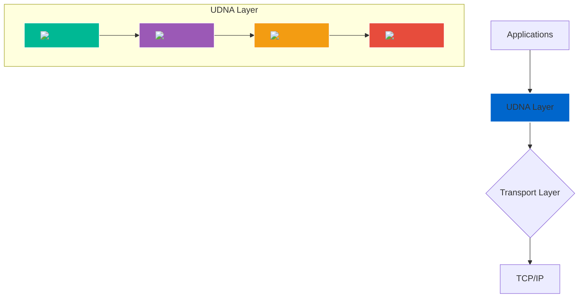

# Universal DID-Native Addressing (UDNA)

<div align="center">

![UDNA Banner](https://img.shields.io/badge/UDNA-Universal%20DID--Native%20Addressing-0066cc?style=for-the-badge&logo=data:image/svg+xml;base64,PHN2ZyB3aWR0aD0iMjQiIGhlaWdodD0iMjQiIHZpZXdCb3g9IjAgMCAyNCAyNCIgZmlsbD0ibm9uZSIgeG1sbnM9Imh0dHA6Ly93d3cudzMub3JnLzIwMDAvc3ZnIj48cGF0aCBkPSJNMTIgMmMtLjYzIDAtMS4xOS4zNS0xLjQ5Ljg4TDAgMjJoMjQuMDAxYy0uOTItNS41Ny0zLjU0LTEwLjI5LTcuNjg1LTEzLjItLjY3LS4zNS0xLjUxLjEtMS44Ni43Ny0uMzUuNjcuMSAxLjUxLjc3IDEuODZDMTkuNTUgMTEuNyAyMS43IDE1LjkyIDIyIDIySDUuNkw2LjUgMTZIMThsMi4zMi0zLjI2Yy42NC0uOTIuMS0yLjE5LS44OC0yLjY4bC0zLjc2LTEuODgtMS42Ny0zLjI5Yy0uMjktLjYtLjg5LS45OS0xLjU3LS44M2gtLjAyYy0uNjkuMTUtMS4yMi42OS0xLjM4IDEuMzZMOS4yNSA5aC0uMDJjLS42NS4wOS0xLjE3LjU4LTEuMjUgMS4yM0w2IDIwLjkyIDEuMTIgMTZjLS42MS0uNjEtLjU0LTEuNjQuMTUtMi4yM2w0LjgtNC44Yy42Mi0uNjIgMS42NC0uNTYgMi4yMi4xNWwxLjI4IDEuNTQgMS4wMi0xLjU0Yy42NC0uOTYgMS45MS0xLjI2IDIuODctLjYybDEuNjcgMS4xIDMuMzItLjgzYzEuMTItLjI4IDIuMjguMTIgMy4wOC45M2wxLjUgMS41Yy42Mi42MiAxLjY0LjU2IDIuMjItLjE1bC40NS0uNDVjLjYyLS42Mi41Ni0xLjY0LS4xNS0yLjIybC0yLjQ3LTIuNDctLjIyLS4yMmMtLjk5LS45OS0yLjM0LTEuMzYtMy42Mi0xLjAybC0zLjU3Ljg5LTIuNS0zLjc2Yy0uNS0uNzUtMS40Mi0xLjE2LTIuMzItLjk1aC0uMDJjLS44OS4yLTEuNTQuODUtMS43NSAxLjc0TDMuMzQgNC4xMmMtLjUuNzUtLjA1IDEuNjkuNyAyLjE5bDQuOCAyLjRMMTIgMTkuMWwxLjA0LTIuMTIgMS41NCAxLjAzYy45OC42NSAyLjI1LjQyIDIuOS0uNTZsMi4zNi0zLjM2Yy42NS0uOTguNDItMi4yNS0uNTYtMi45bC0xLjg0LTEuMjQgMi40LTIuNGMuNTgtLjU4LjU4LTEuNTQgMC0yLjEyLS41OC0uNTgtMS41NC0uNTgtMi4xMiAwbC00Ljk1IDQuOTVjLS41OC41OC0uNTggMS41NCAwIDIuMTIuNTguNTggMS41NC41OCAyLjEyIDBsLjU4LS41OCAxLjA2IDIuMTIgMS41NC0zLjA4Yy4yNS0uNS43NS0uODQgMS4zMS0uODRoNC44MmMuNTcgMCAxLjA4LjM0IDEuMzMuODRsMS42NiAzLjMyYy41Ljk5LS4wNyAyLjE4LTEuMDYgMi42OGwtNS42MiAyLjgxYy0uNDguMjQtMS4wNC4zNi0xLjYuMzZoLTEuMDJjLS41NiAwLTEuMTItLjEyLTEuNi0uMzZsLTUuNjItMi44MWMtLjk5LS41LTEuNTYtMS42OS0xLjA2LTIuNjhsMS42Ni0zLjMyYy4yNS0uNS43NS0uODQgMS4zMy0uODRoNC44MmMuNTYgMCAxLjA2LjM0IDEuMzEuODRsMS41NCAzLjA4LjU4LS41OGMuNTgtLjU4IDEuNTQtLjU4IDIuMTIgMCAuNTguNTguNTggMS41NCAwIDIuMTJsLTQuOTUgNC45NWMtLjU4LjU4LTEuNTQuNTgtMi4xMiAwLS41OC0uNTgtLjU4LTEuNTQgMC0yLjEybDIuNC0yLjQtMS44NC0xLjI0Yy0uOTgtLjY1LTIuMjUtLjQyLTIuOS41NmwtMi4zNiAzLjM2Yy0uNjUuOTgtLjQyIDIuMjUuNTYgMi45bDEuNTQgMS4wMyAxLjA0LTIuMTIgMy4wNi02LjEyIDQuOCAyLjRjLjc1LjUgMS42OS4wNSAyLjE5LS43bDEuMjItMi40NGMuMi0uODkuODUtMS41NCAxLjc0LTEuNzVoLjAyYy45LS4yMSAxLjgyLjIgMi4zMi45NWwyLjUgMy43NiAzLjU3LS44OWMxLjI4LS4zMiAyLjYzLjAzIDMuNjIgMS4wMmwuMjIuMjIgMi40NyAyLjQ3Yy43MS43MS43NyAxLjYuMTUgMi4yMmwtLjQ1LjQ1Yy0uNTguNTgtMS42LjQ3LTIuMjItLjE1bC0xLjUtMS41Yy0uOC0uOC0xLjk2LTEuMjEtMy4wOC0uOTNsLTMuMzIuODMtMS42Ny0xLjFjLS45Ni0uNjQtMi4yMy0uMzQtMi44Ny42MmwtMS4wMiAxLjU0LTEuMjgtMS41NGMtLjU4LS43MS0xLjYtLjc3LTIuMjItLjE1bC00LjggNC44Yy0uNjkuNTktLjc2IDEuNjItLjE1IDIuMjNMNiAyMC45MiA3Ljk4IDkuMzhjLjA4LS42NS42LTEuMTQgMS4yNS0xLjIzaC4wMkM5Ljg5IDggMTAuNDIgNy40NiAxMS4xIDcuMzFsLjAyLjdjLjE2LS42Ny42OS0xLjIxIDEuMzgtMS4zNmgwYy42OC0uMTYgMS4yOC4yMyAxLjU3LjgzbDEuNjcgMy4yOSAzLjc2IDEuODhjLjk4LjQ5IDEuNTIgMS43Ni44OCAyLjY4TDE4IDE2SDYuNUw1LjYgMjJIMjJsLTEwLjUxLTE5LjEyYy0uMy0uNTMtLjg2LS44OC0xLjQ5LS44OHoiIGZpbGw9IiNmZmYiLz48L3N2Zz4=)


**Building the identity-native Internet. A paradigm shift from location-based to identity-based networking.**

[](https://www.w3.org/community/udna/)
[](https://github.com/w3c-udna/udna/stargazers)
[](https://github.com/w3c-udna/udna/discussions)
[](LICENSE)

</div>

##  Table of Contents

-  [Overview](#overview)
-  [Why UDNA?](#why-udna)
-  [Architecture](#architecture)
-  [Key Features](#key-features)
-  [Getting Started](#getting-started)
-  [Contributing](#contributing)
-  [Documentation](#documentation)
-  [Community](#community)
-  [License](#license)

##  Overview

<div align="center">

**Universal DID-Native Addressing (UDNA)** is a next-generation networking protocol that makes cryptographic identity the foundational addressing mechanism for all digital communication.

</div>

UDNA represents a fundamental architectural shift from traditional **location-based addressing** (IP addresses, URLs) to **identity-based addressing** using W3C Decentralized Identifiers (DIDs). This enables secure, private, and self-sovereign communication at global scale.

### The Vision

> "To create an Internet where identity is native to addressing, not an afterthought."

| Traditional Internet | UDNA Internet |
|---------------------|---------------|
|  **Location-based** (IP addresses) |  **Identity-based** (DIDs) |
|  **Bolt-on security** (TLS, VPNs) |  **Built-in security** (cryptographic identity) |
|  **Privacy by accident** |  **Privacy by design** |
|  **Centralized coordination** (DNS, CAs) |  **Decentralized operation** |

##  Why UDNA?

### The Problem with Current Internet Architecture

<table>
<tr>
<th width="50%"></th>
<th width="50%"></th>
</tr>
<tr>
<td>

-  **Fragmented identity systems** across services
-  **Centralized trust dependencies** (CAs, DNS)
-  **Metadata leakage** and surveillance risks
-  **Complex authentication** requiring separate systems
-  **Vendor lock-in** to specific identity providers
-  **No standard way** for services to discover each other

</td>
<td>

-  **Unified identity layer** using W3C DIDs
-  **Decentralized trust** via cryptographic verification
-  **Privacy-preserving** with pairwise identifiers
-  **Native authentication** built into addressing
-  **Self-sovereign control** over digital identity
-  **Built-in service discovery** through DID documents

</td>
</tr>
</table>

### Real-World Impact

| Use Case | Traditional Approach | UDNA Approach |
|----------|-------------------|---------------|
|  **Healthcare** | Separate logins per provider, faxed records | Single DID, encrypted record sharing |
|  **IoT Networks** | Proprietary protocols, cloud dependencies | Device-to-device secure communication |
|  **Enterprise APIs** | API keys, OAuth tokens, complex auth | DID-based addressing with fine-grained capabilities |
|  **Financial Services** | KYC duplication, siloed identity systems | Portable verifiable credentials |

##  Architecture

### Core Components



### 1.  **Addressing Layer**
- **UDNA URI Format**: `udna://did:method/path#fragment`
- **DID Integration**: Native support for all W3C DID methods
- **Service Discovery**: Embedded in DID documents
- **Capability URLs**: Fine-grained access control

### 2.  **Resolution Layer**
- **Multi-tier caching**: Local → P2P → Authoritative
- **Performance targets**: <10ms cached, <200ms network
- **Fallback strategies**: Graceful degradation
- **Load balancing**: Intelligent endpoint selection

### 3.  **Messaging Layer**
- **DIDComm v2 integration**: End-to-end encrypted messaging
- **Multi-transport support**: HTTP, WebSockets, WebRTC
- **Forward secrecy**: Session key rotation
- **Message queuing**: Reliable delivery guarantees

### 4.  **Security Layer**
- **Zero-trust model**: Verify everything
- **Capability-based access**: Fine-grained permissions
- **Privacy preservation**: Pairwise DIDs, correlation resistance
- **Audit logging**: Comprehensive security monitoring

##  Key Features

###  **Security First**
<div align="center">

| Feature | Description | Status |
|---------|-------------|--------|
|  **End-to-End Encryption** | All communications encrypted by default |  |
|  **Cryptographic Verification** | Every message and endpoint verified |  |
|  **Forward Secrecy** | Session keys rotated regularly |  |
|  **Zero-Trust Model** | No implicit trust, everything verified |  |

</div>

###  **High Performance**
-  **Sub-50μs resolution** for cached DIDs
-  **<2ms handshake** latency
-  **Millions of concurrent** connections
-  **Efficient binary protocols** for low bandwidth

###  **Interoperability**
-  **W3C DID Core 1.0** compliant
-  **DIDComm v2** messaging support
-  **Legacy protocol** bridges (HTTP, WebSocket)
-  **Multiple DID method** support (`did:key`, `did:web`, `did:ion`)

###  **Scalability**
-  **Distributed resolution** networks
-  **Peer-to-peer caching** layers
-  **Horizontal scaling** architecture
-  **Global deployment** ready

##  Getting Started

### Quick Start

```bash
# 1. Clone the repository
git clone https://github.com/w3c-udna/udna.git
cd udna

# 2. Install dependencies
npm install
# or
yarn install

# 3. Run the development server
npm run dev
# or
yarn dev

# 4. Open your browser
# http://localhost:3000
```

### Installation Options

<details>
<summary> <strong>Package Managers</strong></summary>

```bash
# NPM
npm install @udna/core @udna/client

# Yarn
yarn add @udna/core @udna/client

# PNPM
pnpm add @udna/core @udna/client
```

</details>

<details>
<summary> <strong>Browser (CDN)</strong></summary>

```html
<script src="https://unpkg.com/@udna/client@latest/dist/browser.min.js"></script>
<script>
  // UDNA is now available as window.UDNA
  const client = new UDNA.Client({ /* config */ });
</script>
```

</details>

<details>
<summary> <strong>Docker</strong></summary>

```bash
# Pull the latest image
docker pull ghcr.io/w3c-udna/udna:latest

# Run the container
docker run -p 3000:3000 ghcr.io/w3c-udna/udna:latest
```

</details>

### Basic Usage Example

```javascript
import { UDNAClient } from '@udna/client';

// Initialize client
const client = new UDNAClient({
  did: 'did:key:z6Mkf5rGMontZ2S6qpnYLAJ3NjBhqXjJcFkNxTvNM7pAqkPc',
  resolver: {
    endpoints: ['https://resolver.udna.dev'],
    cacheTtl: 3600
  }
});

// Resolve a UDNA address
const endpoint = await client.resolve(
  'udna://did:web:api.example.com/services/chat'
);

// Send a secure message
const response = await client.sendMessage({
  to: endpoint,
  type: 'application/json',
  body: { message: 'Hello UDNA!' }
});

console.log('Response:', response);
```

### Framework Integrations

| Framework | Package | Status | Documentation |
|-----------|---------|--------|---------------|
|  **React** | `@udna/react` |  | [Docs](https://udna.dev/docs/react) |
|  **Vue.js** | `@udna/vue` |  | [Docs](https://udna.dev/docs/vue) |
|  **Angular** | `@udna/angular` |  | [Docs](https://udna.dev/docs/angular) |
|  **Node.js** | `@udna/server` |  | [Docs](https://udna.dev/docs/node) |
|  **Python** | `udna-py` |  | [Docs](https://udna.dev/docs/python) |
|  **Go** | `go-udna` |  | [Docs](https://udna.dev/docs/go) |

##  Contributing

We welcome contributions from everyone! Here's how you can help:

### Ways to Contribute

<table>
<tr>
<td width="33%" align="center">

####  **Report Bugs**
Found an issue? Let us know!

[](https://github.com/w3c-udna/udna/issues/new?template=bug_report.md)

</td>
<td width="33%" align="center">

####  **Suggest Features**
Have an idea? Share it with us!

[](https://github.com/w3c-udna/udna/issues/new?template=feature_request.md)

</td>
<td width="33%" align="center">

####  **Write Documentation**
Help improve our docs!

[](https://github.com/w3c-udna/documentation)

</td>
</tr>
</table>

### Development Workflow

1. **Fork the repository**
2. **Create a feature branch**
   ```bash
   git checkout -b feature/amazing-feature
   ```
3. **Make your changes**
4. **Commit your changes**
   ```bash
   git commit -m 'Add amazing feature'
   ```
5. **Push to your branch**
   ```bash
   git push origin feature/amazing-feature
   ```
6. **Open a Pull Request**

### Code Standards

-  **TypeScript** for all new code
-  **ESLint** and **Prettier** for code quality
-  **100% test coverage** for critical paths
-  **Semantic commits** following Conventional Commits
-  **Documentation** for all public APIs

### Good First Issues

Looking for a place to start? Check out these issues:

[](https://github.com/w3c-udna/udna/issues?q=is%3Aopen+is%3Aissue+label%3A%22good+first+issue%22)

##  Documentation

### Comprehensive Guides

| Document | Description | Link |
|----------|-------------|------|
|  **Architecture Guide** | Complete architectural overview | [View](https://udna.dev/docs/architecture) |
|  **API Reference** | Complete API documentation | [View](https://udna.dev/docs/api) |
|  **Getting Started** | Step-by-step setup guide | [View](https://udna.dev/docs/getting-started) |
|  **Security Guide** | Security best practices | [View](https://udna.dev/docs/security) |
|  **Performance Guide** | Optimization techniques | [View](https://udna.dev/docs/performance) |

### Specification Documents

| Specification | Status | Version | Links |
|---------------|--------|---------|-------|
|  **UDNA Core** |  | v0.9 | [Spec](https://udna.dev/spec/core) • [GitHub](https://github.com/w3c-udna/specifications) |
|  **UDNA Addressing** |  | v0.8 | [Spec](https://udna.dev/spec/addressing) |
|  **UDNA Resolution** |  | v0.7 | [Spec](https://udna.dev/spec/resolution) |
|  **UDNA Messaging** |  | v0.8 | [Spec](https://udna.dev/spec/messaging) |

### Tutorials & Examples

| Tutorial | Level | Description |
|----------|-------|-------------|
|  **Build a Secure Chat App** | Beginner | End-to-end encrypted messaging |
|  **Enterprise API Gateway** | Intermediate | DID-based API authentication |
|  **IoT Device Network** | Advanced | Device-to-device communication |
|  **Migration from OAuth** | Intermediate | Transition guide for existing systems |

##  Community

### Join the Conversation

<div align="center">

| Platform | Purpose | Link |
|----------|---------|------|
|  **Mailing List** | Official discussions | [Join](mailto:public-did-native-addr-request@w3.org) |
|  **GitHub Discussions** | Technical Q&A | [Join](https://github.com/w3c-udna/udna/discussions) |
|  **Twitter** | Announcements | [Follow](https://twitter.com/udna_project) |
|  **Blog** | Articles & updates | [Read](https://udna.dev/blog) |

</div>

### Meetings & Events

####  **Weekly Working Sessions**
- **When**: Every Tuesday, 15:00 UTC
- **Where**: [Video Conference](https://meet.google.com/xxx-xxxx-xxx)
- **Agenda**: [GitHub Wiki](https://github.com/w3c-udna/udna/wiki/Meetings)

####  **Monthly Community Calls**
- **When**: First Thursday of each month, 18:00 UTC
- **Where**: [Live Stream](https://youtube.com/c/UDNAProject)
- **Recordings**: [YouTube Playlist](https://youtube.com/playlist?list=...)

### Upcoming Events

| Event | Date | Location | Description |
|-------|------|----------|-------------|
|  **Internet Identity Workshop** | April 2026 | Online | Workshop on decentralized identity |
|  **W3C TPAC 2026** | September 2026 | Montréal | W3C annual conference |
|  **UDNA Hackathon** | June 2026 | Global | Build UDNA-powered applications |

### Project Governance

UDNA follows the **W3C Community Group Process**:

-  **Consensus-based decision making**
-  **Transparent process** with public records
-  **Inclusive participation** from all stakeholders
-  **IPR protection** under W3C Patent Policy

##  License

This project is licensed under the **Apache License 2.0** - see the [LICENSE](LICENSE) file for details.

### Third-Party Licenses

This project includes and depends on the following third-party software:

| Software | License | Purpose |
|----------|---------|---------|
|  **libsodium** | ISC License | Cryptography primitives |
|  **DID Core** | W3C Software License | DID specifications |
|  **DIDComm v2** | Apache 2.0 | Messaging protocol |

### Commercial Use

UDNA is **free for commercial use** under the Apache 2.0 license. Organizations can:

- Use UDNA in proprietary products
- Offer UDNA-based commercial services
- Modify and redistribute UDNA code
- Patent improvements (with patent grant)

---

<div align="center">

##  Supported By

[](https://www.w3.org)
[](https://www.linuxfoundation.org)
[](https://identity.foundation)

##  Star History

[](https://star-history.com/#w3c-udna/udna&Date)

**Universal DID-Native Addressing is more than a protocol—it's a foundation for a more secure, private, and equitable digital future.**

[](https://www.w3.org/community/udna/)

</div>
```

