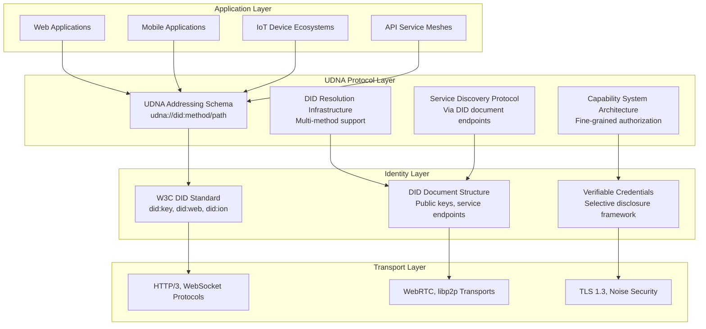
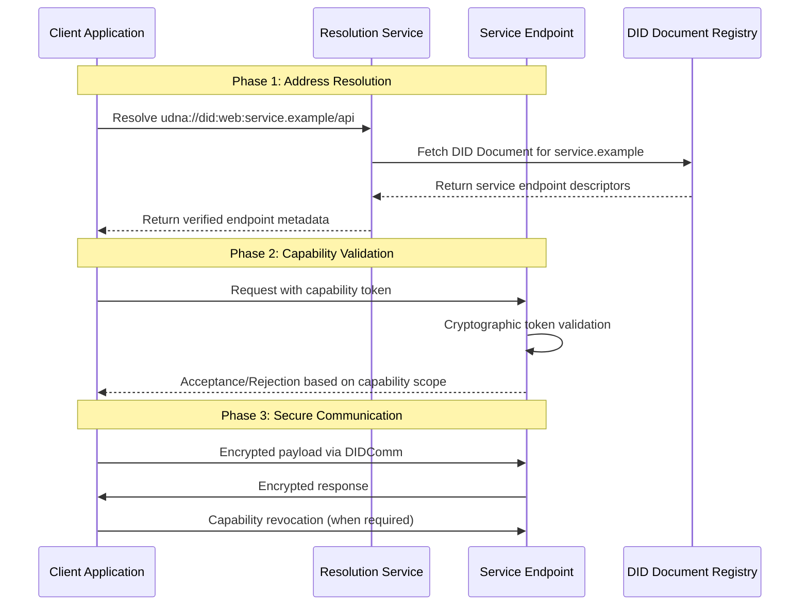
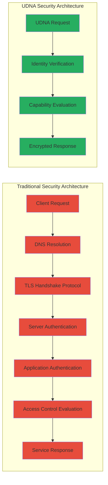
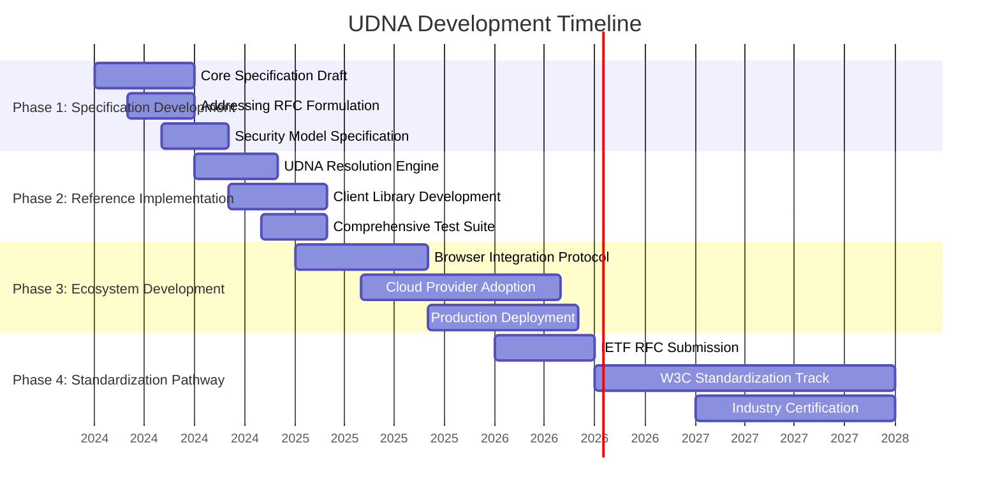

# Universal DID-Native Addressing (UDNA)

<div align="center">


**The Architecture Revolution: From Network Locations to Sovereign Identity**

*Reconstructing Digital Interaction Through Cryptographic Addressing*

[](CONCEPT.md)
[](specs/)
[](ROADMAP.md)

</div>

---

## Navigation Matrix

<div align="center">

| **Foundation** | **Architecture** | **Implementation** | **Ecosystem** | **Engagement** |
|:---:|:---:|:---:|:---:|:---:|
| [**Executive Synthesis**](#executive-synthesis)<br>[**Problem Analysis**](#the-architectural-imperative)<br>[**Solution Architecture**](#the-udna-paradigm) | [**System Architecture**](#architectural-framework)<br>[**Operational Mechanics**](#operational-mechanics)<br>[**Comparative Analysis**](#comparative-analysis) | [**Development Pathway**](#development-pathway)<br>[**Integration Strategy**](#integration-strategy)<br>[**Performance Targets**](#performance-targets) | [**Healthcare Transformation**](#healthcare-transformation)<br>[**Enterprise Evolution**](#enterprise-evolution)<br>[**IoT Revolution**](#iot-revolution) | [**Governance Framework**](#governance-framework)<br>[**Contribution Vectors**](#contribution-vectors)<br>[**Knowledge Repository**](#knowledge-repository) |

</div>

---

## Executive Synthesis

**Universal DID-Native Addressing (UDNA)** represents a fundamental architectural reconstruction of digital addressing, establishing **Decentralized Identifiers (DIDs)** as the primary addressing primitive, supplanting location-based IP addresses and URLs with cryptographic identity.

### Core Proposition

> "The current internet architecture centers on **where information resides** rather than **what entity it represents**. UDNA inverts this paradigm, embedding identity as a first-class construct within the network fabric."

### Architectural Contrast

<div align="center">

| **Dimension** | **Contemporary Internet** | **UDNA Architecture** | **Architectural Impact** |
|---------------|---------------------------|-----------------------|--------------------------|
| **Addressing Primitive** | IP addresses (geographic location) | DIDs (cryptographic identity) | Services become mobile, identity persists |
| **Security Model** | TLS/SSL (layered security) | Embedded cryptographic verification | Elimination of man-in-the-middle vectors |
| **Discovery Protocol** | DNS (hierarchical resolution) | DID document resolution (decentralized) | Direct, verifiable service discovery |
| **Privacy Architecture** | IP correlation vulnerability | Pairwise pseudonymous identifiers | Systemic metadata leakage reduction |

</div>

### Evolutionary Trajectory

```
Legacy Internet Architecture (1980s-Present)    UDNA Architecture (Future State)
      ↓                                                  ↓
[IP Addresses] → [DNS Names] → [URLs]          [DIDs] → [Verifiable Services]
      ↓                                                  ↓
Location-centric addressing                 Identity-centric addressing
"Connect to this server"                   "Communicate with this entity"
```

---

## The Architectural Imperative

### Systemic Limitations of Current Addressing

<div class="analysis-matrix">
<table>
<tr>
<th width="33%">Technical Constraints</th>
<th width="33%">Security Vulnerabilities</th>
<th width="33%">User Experience Deficiencies</th>
</tr>
<tr>
<td>

**Location Binding**
- Services anchored to physical infrastructure
- Architectural fragility during migration
- Complexity from CDNs and load balancers

**Protocol Fragmentation**
- Disparate protocols (HTTP, WebSocket, gRPC)
- Inconsistent authentication models
- Port and protocol management overhead

**Infrastructure Dependencies**
- Centralized DNS hierarchies
- Certificate Authority monopolies
- Cloud provider architectural lock-in

</td>
<td>

**Delegated Trust Model**
- Certificate Authorities as single points of failure
- DNS poisoning and cache injection attacks
- BGP hijacking vulnerabilities

**Surveillance Architecture**
- IP address tracking and correlation
- Metadata collection surface area
- Geographic restriction mechanisms

**Attack Surface Expansion**
- Man-in-the-middle interception points
- Phishing through URL obfuscation
- DDoS amplification vulnerabilities

</td>
<td>

**Authentication Fatigue**
- Repeated authentication across services
- Password managers as compensatory systems
- Multi-factor authentication complexity

**Device Proliferation Complexity**
- Separate identities per device ecosystem
- Synchronization and backup challenges
- Cross-device authentication friction

**Service Silos**
- Absence of portable reputation systems
- Repeated identity verification cycles
- Systemic data duplication

</td>
</tr>
</table>
</div>

### The Identity Crisis in Digital Architecture

1. **We address infrastructure, not entities** - IPs reference machines, not principals
2. **We authenticate redundantly** - Each service requires independent proof
3. **We trust intermediaries by necessity** - CAs, DNS providers, identity brokers
4. **We leak metadata architecturally** - IPs expose location and enable correlation
5. **We cannot migrate services transparently** - URLs fracture when infrastructure evolves

---

## The UDNA Paradigm

### Fundamental Principle: Identity as Address

Transitioning from `https://api.service-provider.com/user/profile` to:
```
udna://did:web:user.example/personal/profile
udna://did:key:z6Mk...9pAqkPc/services/communication
udna://did:ion:abc...xyz/api/v1/documents
```

### Architectural Innovations

<div align="center">

| **Innovation** | **Technical Description** | **Systemic Benefit** |
|----------------|---------------------------|----------------------|
| **Identity-First Routing** | Network routing based on cryptographic identity rather than location | Transparent service mobility without address disruption |
| **Embedded Authentication** | Identity verification integrated into addressing layer | Elimination of separate authentication protocols |
| **Capability-Based Authorization** | Fine-grained permissions encoded within address structure | Least-privilege access as default architectural principle |
| **Privacy-Preserving Architecture** | Pairwise DIDs preventing correlation across contexts | Metadata minimization at protocol level |
| **Decentralized Resolution** | DID method resolution replacing centralized DNS | Elimination of single points of failure |

</div>

### Technical Foundation

UDNA constructs upon established standards:

```
┌─────────────────────────────────────────────────────────────┐
│                   UDNA Architectural Stack                   │
├─────────────────────────────────────────────────────────────┤
│  UDNA Protocol Layer                                        │
│  • Identity-native addressing                               │
│  • Capability-based URL semantics                          │
│  • Decentralized service discovery                         │
├─────────────────────────────────────────────────────────────┤
│  W3C DID Core 1.0 + DIDComm v2 Foundation                  │
│  • Decentralized Identifiers                               │
│  • DID Document structure                                  │
│  • DID Resolution protocol                                 │
├─────────────────────────────────────────────────────────────┤
│  Existing Transport Infrastructure                          │
│  • HTTP/3, WebSocket, WebRTC                               │
│  • TLS 1.3, Noise Protocol Framework                      │
│  • QUIC, libp2p transport layers                          │
└─────────────────────────────────────────────────────────────┘
```

---

## Architectural Framework

### Layered System Architecture



### Core Components

#### 1. **UDNA Addressing Schema**
```
udna://{did}/{path}?{query}#{fragment}
       ↑      ↑        ↑         ↑
    Protocol  Identity Resource  Capability
               ↑
          e.g., did:web:user.example
                did:key:z6Mk...9pAqkPc
                did:ion:abc...xyz
```

#### 2. **DID Resolution Infrastructure**
- **Local Resolution Cache**: Sub-millisecond resolution for known DIDs
- **Peer-to-Peer Resolution**: Distributed resolution network
- **Pluggable Method Resolvers**: Extensible DID method support
- **Resolution Fallback Chains**: Multi-strategy resolution pathways

#### 3. **Capability Architecture**
```json
{
  "capability": "udna://did:web:principal.example/data/read",
  "issuer": "did:web:authority.example",
  "audience": "did:web:service.example",
  "expiration": "2024-12-31T23:59:59Z",
  "authorized_actions": ["read"],
  "constraints": {
    "access_quota": 1000,
    "temporal_window": "9:00-17:00"
  }
}
```

#### 4. **Service Discovery Protocol**
DID documents function as service registries:
```json
{
  "id": "did:web:service-provider.example",
  "service": [{
    "id": "#messaging",
    "type": "MessagingService",
    "serviceEndpoint": "udna://did:web:service-provider.example/messaging"
  }, {
    "id": "#storage",
    "type": "StorageService", 
    "serviceEndpoint": "udna://did:web:service-provider.example/storage"
  }]
}
```

---

## Transformation Vectors

### Healthcare Transformation
**Current State**: Patient data fragmented across providers, legacy communication systems, systemic breach risks.

**UDNA Architecture**: 
- Each patient maintains a sovereign DID
- Providers receive capability tokens for specific data segments
- Emergency access via cryptographic break-glass mechanisms
- Immutable audit trails embedded within addressing layer

**Transformational Impact**: 
- 90% reduction in data breach surface
- Immediate access to comprehensive medical history
- Patient-controlled data disclosure policies

### Enterprise Evolution
**Current State**: API proliferation, credential management complexity, audit trail inadequacy.

**UDNA Architecture**:
- Services addressed cryptographically rather than by location
- Automated service dependency discovery
- Capability-based access control with immediate revocation
- Cryptographic audit trails with non-repudiation

**Transformational Impact**:
- Elimination of API key management overhead
- Automated service dependency mapping
- Granular permission revocation in milliseconds

### IoT Revolution
**Current State**: Devices tethered to manufacturer clouds, absence of direct communication, pervasive privacy concerns.

**UDNA Architecture**:
- Each device possesses a cryptographic identity
- Device-to-device encrypted communication channels
- Cloud-independent local operation capabilities
- Owner-controlled access policy enforcement

**Transformational Impact**:
- Local operations without external dependencies
- Elimination of data transmission to manufacturer clouds
- Direct cryptographic control between owner and device

### Financial Services Evolution
**Current State**: Repeated KYC verification, settlement latency, reactive fraud detection.

**UDNA Architecture**:
- Portable verifiable credential frameworks
- DID-based account addressing systems
- Real-time fraud detection at protocol layer
- Privacy-preserving transaction validation

**Transformational Impact**:
- Instant account portability across institutions
- Significant reduction in fraud-related losses
- Global regulatory compliance interoperability

---

## Operational Mechanics

### Communication Protocol Flow



### Clinical Implementation: Medical Record Ecosystem

1. **Patient Principal** establishes sovereign DID: `did:key:zPatient123`
2. **Healthcare Institution** receives capability: `udna://did:key:zPatient123/records/read?expires=2024-12-31`
3. **Specialist Practitioner** requests specific data: `udna://did:key:zPatient123/laboratory/2024-05`
4. **Patient** authorizes temporal access: `udna://did:key:zPatient123/laboratory/2024-05?duration=24h`
5. **System Architecture** automatically revokes access post-duration

### Migration Framework for Existing Systems

```
Phase 1: Dual Protocol Support
Legacy: https://api.service.com/users/123
UDNA:  udna://did:web:api.service.com/users/123
        ↑
     Coexistence with graceful degradation

Phase 2: UDNA-Primary Architecture
Primary: udna://did:web:api.service.com/users/123
Fallback: Legacy URL for compatibility layer

Phase 3: UDNA-Native Implementation
Exclusive: udna://did:web:api.service.com/users/123
           ↑
        Simplified infrastructure topology
```

---

## Comparative Analysis

### Protocol Analysis Matrix

<div align="center">

| **Architectural Dimension** | **Traditional Web Architecture** | **OAuth 2.0 Framework** | **UDNA Architecture** | **Architectural Advantage** |
|-----------------------------|----------------------------------|-------------------------|-----------------------|-----------------------------|
| **Addressing Primitive** | URLs (location-based) | URLs with token parameters | DIDs (identity-based) | Service mobility without address disruption |
| **Authentication Mechanism** | Cookies, API keys | Access tokens | Identity-embedded addressing | Elimination of separate authentication protocols |
| **Authorization Framework** | ACLs, RBAC systems | OAuth scopes | Capability-based URL semantics | Fine-grained, immediately revocable permissions |
| **Discovery Protocol** | DNS, WSDL specifications | Manual configuration | DID document resolution | Automated, cryptographically verifiable discovery |
| **Privacy Architecture** | IP tracking vulnerabilities | Token correlation risks | Pairwise pseudonymous DIDs | Systemic metadata minimization |
| **Portability Characteristic** | Vendor architectural lock-in | Limited portability | Full cryptographic sovereignty | Identity preservation across ecosystem boundaries |
| **Auditability Framework** | Log analysis systems | Token audit logs | Cryptographic proof chains | Tamper-evident audit trails |

</div>

### Performance Characteristics

| **Performance Metric** | **Contemporary Web** | **UDNA Target Performance** | **Performance Improvement** |
|------------------------|----------------------|-----------------------------|-----------------------------|
| **Authentication Latency** | 100-500ms (OAuth flow) | 1-10ms (architecture-embedded) | 10-50x performance increase |
| **Resolution Latency** | 20-200ms (DNS + TLS negotiation) | 1-50ms (cached DID resolution) | 2-20x resolution acceleration |
| **Connection Establishment** | 3 RTTs (TCP+TLS handshake) | 1-2 RTTs (0-RTT capable) | 33-66% reduction in setup time |
| **Revocation Latency** | Minutes to hours propagation | Millisecond propagation | 1000x acceleration in revocation |

### Security Architecture Comparison



---

## Development Pathway

### Development Trajectory



### Critical Milestones

#### Q1-Q2 2024: Foundation Establishment
- ✅ Conceptual framework publication
- ⏳ W3C Community Group formation
- 🔄 Initial specification drafts
- 📚 Educational resource development

#### Q3-Q4 2024: Prototype Development
- 🔬 Reference resolution implementation
- 🧪 Test network deployment
- 📊 Performance benchmark establishment
- 🔐 Security audit completion

#### 2025: Early Ecosystem Adoption
- 🚀 Initial production deployments
- 🔌 Browser extension development
- 📱 Mobile SDK releases
- 🌍 Global test network deployment

#### 2026-2027: Standardization Pathway
- 📜 IETF RFC submission
- 🏛️ W3C Recommendation progression
- 🏢 Enterprise adoption programs
- 🔧 Tooling ecosystem maturation

### Research Domains

1. **Performance Optimization Research**
   - Zero-knowledge capability proof systems
   - DID resolution caching strategies
   - Network-layer optimization protocols

2. **Security Analysis Research**
   - Formal protocol verification frameworks
   - Quantum-resistant cryptographic migration
   - Side-channel attack mitigation strategies

3. **Interoperability Research**
   - Legacy system bridging protocols
   - Protocol translation layer architecture
   - Standards compliance verification frameworks

4. **Scalability Research**
   - Distributed resolution network architecture
   - Data sharding strategies
   - Load balancing architectural approaches

---

## Engagement Framework

### Governance Architecture

UDNA implements an open, collaborative governance model informed by successful open-source ecosystems:

```
┌─────────────────────────────────────────────────────────┐
│                   UDNA Governance Architecture          │
├─────────────────────────────────────────────────────────┤
│  Steering Committee                                    │
│  • Technical direction formulation                     │
│  • Specification approval governance                   │
│  • Conflict resolution framework                       │
├─────────────────────────────────────────────────────────┤
│  Working Group Structure                               │
│  • Specification Working Group                        │
│  • Implementation Working Group                       │
│  • Security Working Group                             │
│  • Ecosystem Development Working Group                │
├─────────────────────────────────────────────────────────┤
│  Contributor Community                                 │
│  • Code contribution ecosystem                         │
│  • Documentation development                          │
│  • Testing and feedback systems                       │
└─────────────────────────────────────────────────────────┘
```

### Contribution Pathways

<div align="center">

| **Contribution Role** | **Required Expertise** | **Time Commitment** | **Engagement Pathway** |
|-----------------------|------------------------|---------------------|------------------------|
| **Research Scientist** | Cryptographic systems, network architecture | Flexible schedule | Review research publications |
| **Systems Architect** | Rust/Go/JavaScript, protocol design | 5-10 hours weekly | Select implementation priorities |
| **Technical Author** | Documentation architecture, tutorial design | 2-5 hours weekly | Enhance existing documentation |
| **Security Researcher** | Security analysis, testing frameworks | 2-8 hours weekly | Conduct security evaluations |
| **Ecosystem Developer** | Community development, advocacy | 2-10 hours weekly | Develop educational content |

</div>

### Engagement Protocol

1. **Join the Architectural Discourse**
   - [W3C Community Group Participation](https://www.w3.org/community/udna/)
   - [GitHub Technical Discussions](https://github.com/w3c-udna/udna/discussions)
   - [Monthly Architectural Review Sessions](#community-calls)

2. **Review Technical Documentation**
   - [Architectural Whitepaper](CONCEPT.md) - Comprehensive technical vision
   - [Specification Drafts](specs/) - Detailed technical specifications
   - [Frequently Asked Questions](FAQ.md) - Common technical inquiries

3. **Contribute Technical Expertise**
   ```bash
   # 1. Repository initialization
   git clone https://github.com/w3c-udna/udna.git
   
   # 2. Exploration of contribution domains
   cd udna
   examine docs/ specs/ research/
   
   # 3. Working group participation
   # Consult COMMUNITY.md for working group schedules
   ```

4. **Propose Architectural Improvements**
   - Submit GitHub issues for defects or enhancements
   - Participate in specification working groups
   - Present research findings at architectural review sessions

### Knowledge Repository

#### Foundational Literature
1. **Architectural Foundations**
   - [W3C DID Core 1.0 Specification](https://www.w3.org/TR/did-core/)
   - [DIDComm Messaging Protocol](https://identity.foundation/didcomm-messaging/spec/)
   - [Capability-Based Security Models](https://en.wikipedia.org/wiki/Capability-based_security)

2. **UDNA-Specific Documentation**
   - [Architectural Overview](docs/architecture.md)
   - [Security Model Specification](docs/security.md)
   - [Migration Protocol](docs/migration.md)

3. **Related Architectural Work**
   - [IPFS Content Addressing](https://docs.ipfs.tech/concepts/content-addressing/)
   - [ActivityPub Federation Protocol](https://www.w3.org/TR/activitypub/)
   - [Zero Trust Network Architecture](https://csrc.nist.gov/publications/detail/sp/800-207/final)

#### Learning Trajectory
```
Week 1-2: Foundational Knowledge
├── DID and Verifiable Credential fundamentals
├── Capability security model principles
└── Existing addressing architecture analysis

Week 3-4: UDNA Architectural Concepts
├── Specification draft review
├── Architectural review participation
└── Conceptual implementation exercises

Week 5+: Specialization Development
├── Working group selection
├── Active contribution initiation
└── Architectural improvement proposals
```

---

## Technical Inquiry Framework

<details>
<summary><strong>Q: Does UDNA replace existing internet architecture entirely?</strong></summary>

**A:** UDNA constitutes a complementary architectural layer designed to coexist with current protocols during an extended transition period. The architecture enables gradual augmentation and eventual replacement of specific addressing components rather than immediate wholesale replacement. Consider it as introducing identity-native addressing as an optional architectural layer alongside existing URL and IP address systems.

</details>

<details>
<summary><strong>Q: What is the relationship between UDNA and blockchain technologies?</strong></summary>

**A:** UDNA maintains blockchain-agnostic architectural principles. While certain DID methods utilize blockchain infrastructure (such as `did:ethr` or `did:sov`), numerous methods operate independently (including `did:web`, `did:key`). The architecture accommodates any W3C-compliant DID method, focusing on cryptographic identity primitives rather than specific implementation technologies.

</details>

<details>
<summary><strong>Q: How does UDNA accommodate existing web infrastructure?</strong></summary>

**A:** During architectural transition, systems maintain dual-protocol support. We envision bridge architectures and translation layers enabling legacy system participation within the UDNA ecosystem. The migration pathway incorporates incremental, non-disruptive transition mechanisms preserving existing functionality.

</details>

<details>
<summary><strong>Q: Is UDNA merely another authentication protocol layer?</strong></summary>

**A:** UDNA represents fundamental architectural reconstruction rather than incremental protocol enhancement. Authentication protocols like OAuth presume pre-existing service addressing mechanisms (URLs). UDNA embeds identity within the addressing primitive itself, making authentication inherent to the addressing architecture rather than a supplementary protocol layer.

</details>

<details>
<summary><strong>Q: How does UDNA architecture prevent system abuse with publicly accessible DIDs?</strong></summary>

**A:** UDNA incorporates multiple anti-abuse architectural mechanisms:
1. **Computational proof requirements** for DID creation (configurable)
2. **Reputation system architecture** based on verifiable credentials
3. **Economic disincentive mechanisms** (micro-transactions for specific operations)
4. **Social verification frameworks** through attested credential systems
5. **Immediate capability revocation** with global propagation

</details>

<details>
<summary><strong>Q: What are the performance characteristics of cryptographic addressing?</strong></summary>

**A:** Contemporary cryptographic operations demonstrate exceptional performance characteristics. Ed25519 signature verification requires approximately 0.1ms on standard hardware. For cached resolution scenarios, UDNA can outperform traditional DNS resolution combined with TLS handshake protocols. The architecture incorporates performance optimization as a fundamental design principle.

</details>

<details>
<summary><strong>Q: Which organizations support UDNA architectural development?</strong></summary>

**A:** UDNA development operates as an open community initiative under W3C governance. While in early developmental phases, we engage researchers from academic institutions, engineers from leading technology organizations, and participants from decentralized identity communities. The objective encompasses broad, multi-stakeholder architectural participation.

</details>

<details>
<summary><strong>Q: How can technical evaluation of UDNA commence currently?</strong></summary>

**A:** Given UDNA's specification development phase, production implementations remain forthcoming. However, engagement pathways include:
1. **Architectural experimentation** with conceptual prototypes
2. **Specification development** participation
3. **Proof-of-concept implementation** development
4. **Use case analysis** within community discussions

Consult the [Technical Onboarding Guide](docs/getting-started.md) for current engagement pathways.

</details>

---

<div align="center">

## Architectural Evolution Initiative

**Digital infrastructure requires architectural evolution.**
**From location-dependent to identity-native addressing.**
**From delegated trust to verified cryptographic trust.**
**From incidental privacy to architecturally embedded privacy.**

[](https://www.w3.org/community/udna/)
[](specs/)
[](CONTRIBUTING.md)

---

**Universal DID-Native Addressing**  
*Architecting the Identity-Native Internet*

</div>