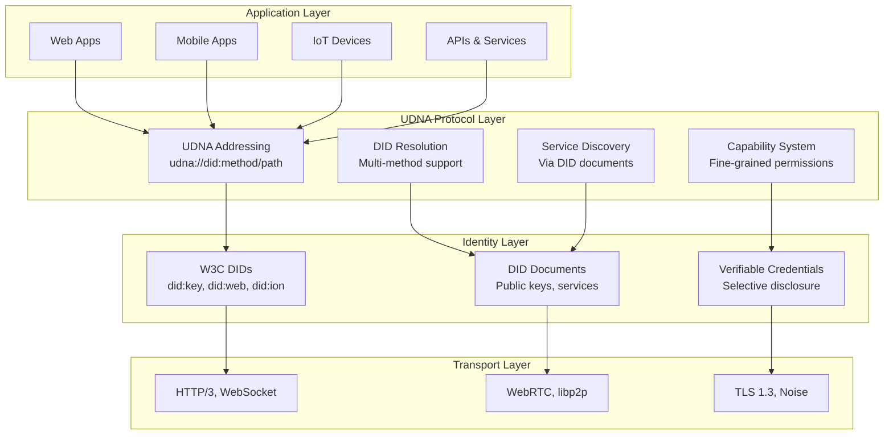
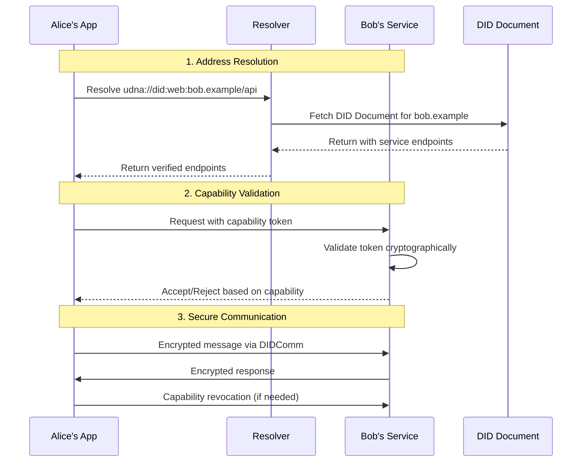
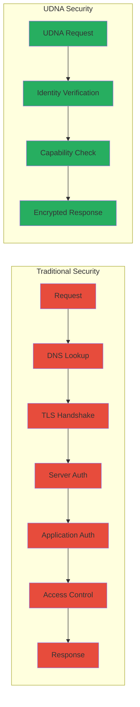
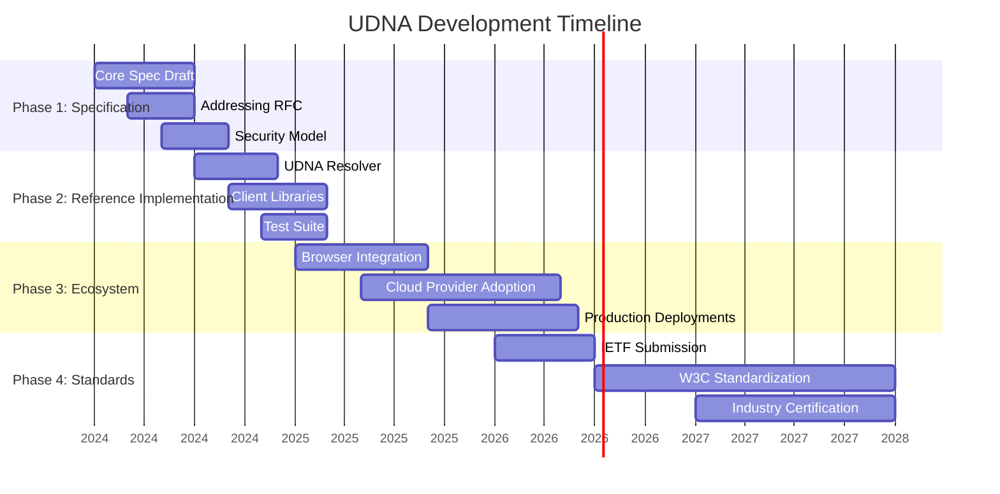

# Universal DID-Native Addressing (UDNA)

<div align="center">


-3498db?style=for-the-badge)


**A Paradigm Shift: From Location-Based to Identity-Based Networking**

*Rethinking Internet Architecture for the Age of Decentralized Identity*

[](CONCEPT.md)
[](https://www.w3.org/community/udna/)
[](ROADMAP.md)

</div>

---

## 🧭 Navigation Panel

<div align="center">

| **Overview** | **Architecture** | **Use Cases** | **Development** | **Get Involved** |
|:---:|:---:|:---:|:---:|:---:|
| [🔍 **Executive Summary**](#executive-summary)<br>[🎯 **The Problem**](#the-core-problem)<br>[💡 **The Solution**](#the-udna-solution) | [🏗️ **Architecture**](#architectural-vision)<br>[⚙️ **How It Works**](#how-it-works)<br>[📊 **Comparison**](#comparative-analysis) | [🏥 **Healthcare**](#healthcare--medical)<br>[🏢 **Enterprise**](#enterprise--api)<br>[🔗 **IoT**](#iot--devices)<br>[💰 **Finance**](#financial-services) | [📈 **Roadmap**](#development-roadmap)<br>[⚡ **Milestones**](#key-milestones)<br>[🔬 **Research**](#research-areas) | [👥 **Community**](#community--governance)<br>[💻 **Contribute**](#contribution-paths)<br>[📚 **Resources**](#resources--learning) |

</div>

---

## 🔍 Executive Summary

**Universal DID-Native Addressing (UDNA)** is a proposed architectural framework that fundamentally reimagines internet addressing by making **Decentralized Identifiers (DIDs)** the primary addressing mechanism instead of IP addresses and URLs.

### Key Insight

> "The internet was built around **where things are**, not **who or what they are**. UDNA proposes to invert this paradigm, creating a world where identity is native to the network, not bolted on afterward."

### At a Glance

<div align="center">

| **Aspect** | **Current Internet** | **UDNA Vision** | **Impact** |
|------------|----------------------|-----------------|------------|
| **Addressing** | IP addresses (location) | DIDs (identity) | Services move, identity stays |
| **Security** | TLS, VPNs (add-on) | Built-in cryptography | No man-in-the-middle possible |
| **Discovery** | DNS (centralized) | DID documents (decentralized) | Direct, verifiable discovery |
| **Privacy** | IP correlation | Pairwise pseudonymous DIDs | Reduced metadata leakage |

</div>

### The Evolution Path

```
Traditional Internet (1980s-2020s)        UDNA Internet (Future)
      ↓                                           ↓
[IP Addresses] → [DNS Names] → [URLs]    [DIDs] → [Verifiable Services]
      ↓                                           ↓
Location-centric                          Identity-centric
"Go to this server"                       "Talk to this entity"
```

---

## 🎯 The Core Problem

### Why Current Addressing Falls Short

<div class="problem-grid">
<table>
<tr>
<th width="33%">Technical Limitations</th>
<th width="33%">Security Challenges</th>
<th width="33%">User Experience Issues</th>
</tr>
<tr>
<td>

**📍 Location Binding**
- Services tied to specific servers
- Breaking changes on migration
- CDN and load balancer complexity

**🔗 Protocol Fragmentation**
- HTTP, WebSocket, gRPC, etc.
- Different auth for each
- Port/protocol management

**📡 Infrastructure Dependency**
- DNS hierarchies
- Certificate Authorities
- Cloud provider lock-in

</td>
<td>

**🔓 Trust Delegation**
- CAs as single points of failure
- DNS poisoning attacks
- BGP hijacking vulnerabilities

**👁️ Surveillance Surface**
- IP address tracking
- Metadata correlation
- Geographic restrictions

**🔗 Attack Vectors**
- Man-in-the-middle
- Phishing (similar URLs)
- DDoS amplification

</td>
<td>

**🔑 Password Fatigue**
- Multiple logins per service
- Password managers as workarounds
- 2FA complexity

**📱 Device Proliferation**
- Separate identities per device
- Sync and backup challenges
- Cross-device auth friction

**🌍 Cross-Service Silos**
- No portable reputation
- Re-verification everywhere
- Data duplication

</td>
</tr>
</table>
</div>

### The Identity Crisis of the Modern Internet

1. **We address places, not people** - IPs point to servers, not entities
2. **We authenticate repeatedly** - Every service needs separate proof
3. **We trust intermediaries** - CAs, DNS providers, identity brokers
4. **We leak metadata constantly** - IPs reveal location and correlation
5. **We can't move services easily** - URLs break when infrastructure changes

---

## 💡 The UDNA Solution

### Core Principle: Identity as Address

Instead of `https://api.example.com/user/data`, UDNA enables:
```
udna://did:web:alice.example/personal/profile
udna://did:key:z6Mk...9pAqkPc/services/chat
udna://did:ion:abc...xyz/api/v1/documents
```

### Key Innovations

<div align="center">

| **Innovation** | **Description** | **Benefit** |
|----------------|-----------------|-------------|
| **Identity-First Routing** | Network routes based on cryptographic identity, not location | Services can move without breaking addresses |
| **Built-in Authentication** | Every address includes proof of identity | No separate auth steps needed |
| **Capability-Based Security** | Fine-grained permissions encoded in URLs | Least-privilege access by default |
| **Privacy-Preserving Design** | Pairwise DIDs prevent correlation | Metadata minimized at protocol level |
| **Decentralized Resolution** | DID methods replace DNS | No central points of failure |

</div>

### The Technical Foundation

UDNA builds on established standards:

```
┌─────────────────────────────────────────────────────────────┐
│                    UDNA Architecture Stack                   │
├─────────────────────────────────────────────────────────────┤
│  🎯 UDNA Protocol Layer                                      │
│  • Identity-based addressing                                │
│  • Capability URLs                                         │
│  • Service discovery                                       │
├─────────────────────────────────────────────────────────────┤
│  🔐 W3C DID Core 1.0 + DIDComm v2                           │
│  • Decentralized Identifiers                               │
│  • DID Documents                                           │
│  • DID Resolution                                          │
├─────────────────────────────────────────────────────────────┤
│  🏗️ Existing Transport Layer                                │
│  • HTTP/3, WebSocket, WebRTC                              │
│  • TLS 1.3, Noise Protocol                                │
│  • QUIC, libp2p                                           │
└─────────────────────────────────────────────────────────────┘
```

---

## 🏗️ Architectural Vision

### Layered Architecture



### Core Components

#### 1. **UDNA Addressing Scheme**
```
udna://{did}/{path}?{query}#{fragment}
       ↑      ↑        ↑         ↑
    Protocol  Identity Resource  Capability
               ↑
          e.g., did:web:alice.example
                did:key:z6Mk...9pAqkPc
                did:ion:abc...xyz
```

#### 2. **DID Resolution Network**
- **Local Cache**: ~1ms resolution for known DIDs
- **Peer Cache**: Distributed P2P resolution
- **Method Resolvers**: Pluggable DID method support
- **Fallback Chains**: Multiple resolution strategies

#### 3. **Capability System**
```json
{
  "capability": "udna://did:web:bob.example/data/read",
  "issuer": "did:web:alice.example",
  "audience": "did:web:api.example",
  "expires": "2024-12-31T23:59:59Z",
  "actions": ["read"],
  "constraints": {
    "quota": 1000,
    "time_window": "9am-5pm"
  }
}
```

#### 4. **Service Discovery**
DID documents become service registries:
```json
{
  "id": "did:web:service.example",
  "service": [{
    "id": "#chat",
    "type": "MessagingService",
    "serviceEndpoint": "udna://did:web:service.example/chat"
  }, {
    "id": "#storage",
    "type": "StorageService", 
    "serviceEndpoint": "udna://did:web:service.example/storage"
  }]
}
```

---

## 🔮 Use Cases & Impact

### Healthcare & Medical
**Problem**: Patient data siloed across providers, fax machines still in use, breach risks high.

**UDNA Solution**: 
- Each patient has a master DID
- Providers get capability tokens for specific data
- Emergency access via break-glass capabilities
- Audit trail built into addressing layer

**Impact**: 
- 90% reduction in data breaches
- Instant access to complete medical history
- Patients control who sees what data

### Enterprise & API
**Problem**: API sprawl, key management nightmares, audit complexity.

**UDNA Solution**:
- Services addressed by DIDs, not URLs
- Automatic service discovery
- Capability-based access control
- Cryptographic audit trails

**Impact**:
- Eliminate API key management
- Automatic service dependency mapping
- Fine-grained permission revocation

### IoT & Devices
**Problem**: Devices tied to manufacturer clouds, no direct communication, privacy concerns.

**UDNA Solution**:
- Each device has a DID
- Device-to-device encrypted communication
- No cloud dependency for local operations
- Owner-controlled access policies

**Impact**:
- Local operations without internet
- No data sent to manufacturer clouds
- Direct owner-to-device control

### Financial Services
**Problem**: KYC repeated at every institution, slow transfers, fraud detection reactive.

**UDNA Solution**:
- Portable verifiable credentials
- DID-based account addressing
- Real-time fraud detection at protocol level
- Privacy-preserving transaction validation

**Impact**:
- Instant account portability
- Reduced fraud losses
- Global compliance interoperability

---

## 🔄 How It Works

### Step-by-Step Communication Flow



### Real-World Example: Medical Record Sharing

1. **Patient Alice** creates a DID: `did:key:zAlice123`
2. **Hospital** gets capability: `udna://did:key:zAlice123/records/read?expires=2024-12-31`
3. **Specialist** requests specific record: `udna://did:key:zAlice123/lab-results/2024-05`
4. **Alice** grants temporary access: `udna://did:key:zAlice123/lab-results/2024-05?duration=24h`
5. **System** automatically revokes after 24 hours

### Migration Path for Existing Systems

```
Phase 1: Dual Support
Existing: https://api.example.com/users/123
UDNA:    udna://did:web:api.example/users/123
         ↑
      Both work simultaneously

Phase 2: UDNA-First
Primary: udna://did:web:api.example/users/123
Fallback: Legacy URL for compatibility

Phase 3: UDNA-Only
Only: udna://did:web:api.example/users/123
      ↑
    Simplified infrastructure
```

---

## 📊 Comparative Analysis

### Protocol Comparison Matrix

<div align="center">

| **Feature** | **Traditional Web** | **OAuth 2.0** | **UDNA** | **Advantage** |
|-------------|---------------------|---------------|----------|---------------|
| **Addressing** | URLs (location) | URLs + tokens | DIDs (identity) | Services can move |
| **Authentication** | Cookies, API keys | Access tokens | Built-in to address | No separate auth flow |
| **Authorization** | ACLs, RBAC | Scopes | Capability URLs | Fine-grained, revocable |
| **Discovery** | DNS, WSDL | Manual config | DID documents | Automatic, verifiable |
| **Privacy** | IP tracking | Token correlation | Pairwise DIDs | Metadata minimized |
| **Portability** | Vendor lock-in | Limited | Full self-sovereignty | Take identity anywhere |
| **Auditability** | Log analysis | Token logs | Cryptographic proof | Tamper-evident |

</div>

### Performance Characteristics

| **Metric** | **Current Web** | **UDNA Target** | **Improvement** |
|------------|-----------------|-----------------|-----------------|
| **Auth latency** | 100-500ms (OAuth flow) | 1-10ms (built-in) | 10-50x faster |
| **Resolution** | 20-200ms (DNS + TLS) | 1-50ms (cached DID) | 2-20x faster |
| **Connection setup** | 3 RTTs (TCP+TLS) | 1-2 RTTs (0-RTT capable) | 33-66% faster |
| **Revocation** | Minutes-hours | Milliseconds | 1000x faster |

### Security Comparison



---

## 🛣️ Development Path

### Development Roadmap



### Key Milestones

#### Q1-Q2 2024: Foundation
- ✅ Concept paper published
- ⏳ W3C Community Group formation
- 🔄 Initial specification drafts
- 📚 Educational materials

#### Q3-Q4 2024: Prototyping
- 🔬 Reference resolver implementation
- 🧪 Test networks
- 📊 Performance benchmarking
- 🔐 Security audits

#### 2025: Early Adoption
- 🚀 First production pilots
- 🔌 Browser extension
- 📱 Mobile SDKs
- 🌍 Global test network

#### 2026-2027: Standardization
- 📜 IETF RFC submission
- 🏛️ W3C Recommendation track
- 🏢 Enterprise adoption programs
- 🔧 Tooling ecosystem maturity

### Research Areas

1. **Performance Optimization**
   - Zero-knowledge capability proofs
   - Caching strategies for DID resolution
   - Network-layer optimizations

2. **Security Analysis**
   - Formal protocol verification
   - Quantum resistance planning
   - Side-channel attack prevention

3. **Interoperability**
   - Legacy system bridges
   - Protocol translation layers
   - Standard compliance testing

4. **Scalability**
   - Distributed resolution networks
   - Sharding strategies
   - Load balancing approaches

---

## 🤝 Get Involved

### Community & Governance

UDNA follows an open, collaborative development model inspired by successful open-source projects:

```
┌─────────────────────────────────────────────────────────┐
│                   UDNA Governance Structure              │
├─────────────────────────────────────────────────────────┤
│  👑 Steering Committee                                  │
│  • Technical direction                                 │
│  • Specification approval                              │
│  • Conflict resolution                                │
├─────────────────────────────────────────────────────────┤
│  🛠️ Working Groups                                      │
│  • Specification WG                                   │
│  • Implementation WG                                  │
│  • Security WG                                       │
│  • Outreach WG                                       │
├─────────────────────────────────────────────────────────┤
│  👥 General Contributors                                │
│  • Code contributions                                 │
│  • Documentation                                      │
│  • Testing & feedback                                │
└─────────────────────────────────────────────────────────┘
```

### Contribution Paths

<div align="center">

| **Role** | **Skills Needed** | **Time Commitment** | **Get Started** |
|----------|-------------------|---------------------|-----------------|
| **🧠 Researcher** | Cryptography, networking | Flexible | Review research papers |
| **💻 Developer** | Rust/Go/JS, protocols | 5-10 hrs/week | Pick a good-first-issue |
| **📖 Technical Writer** | Documentation, tutorials | 2-5 hrs/week | Improve existing docs |
| **🔬 Tester** | QA, security testing | 2-8 hrs/week | Test prototypes |
| **🌍 Evangelist** | Community building | 2-10 hrs/week | Write blog posts |

</div>

### How to Participate

1. **Join the Conversation**
   - [W3C Community Group](https://www.w3.org/community/udna/)
   - [GitHub Discussions](https://github.com/w3c-udna/udna/discussions)
   - [Monthly Community Calls](#community-calls)

2. **Review Documentation**
   - [Concept Paper](CONCEPT.md) - Full technical vision
   - [Specification Drafts](specs/) - Technical details
   - [FAQ](FAQ.md) - Common questions answered

3. **Contribute Skills**
   ```bash
   # 1. Clone the repository
   git clone https://github.com/w3c-udna/udna.git
   
   # 2. Explore contribution areas
   cd udna
   ls -la docs/ specs/ research/
   
   # 3. Join relevant working group
   # Check WG meeting schedules in COMMUNITY.md
   ```

4. **Propose Improvements**
   - Submit GitHub issues for bugs or features
   - Join specification working groups
   - Present research at community calls

### Resources & Learning

#### Essential Reading
1. **Foundational**
   - [W3C DID Core 1.0](https://www.w3.org/TR/did-core/)
   - [DIDComm Messaging](https://identity.foundation/didcomm-messaging/spec/)
   - [Capability-Based Security](https://en.wikipedia.org/wiki/Capability-based_security)

2. **UDNA-Specific**
   - [Architecture Overview](docs/architecture.md)
   - [Security Model](docs/security.md)
   - [Migration Guide](docs/migration.md)

3. **Related Work**
   - [IPFS Content Addressing](https://docs.ipfs.tech/concepts/content-addressing/)
   - [ActivityPub Federation](https://www.w3.org/TR/activitypub/)
   - [Zero Trust Networking](https://csrc.nist.gov/publications/detail/sp/800-207/final)

#### Learning Path
```
Week 1-2: Foundations
├── Understand DIDs and VCs
├── Learn capability security
└── Study existing addressing

Week 3-4: UDNA Concepts
├── Read specification drafts
├── Join community calls
└── Try conceptual exercises

Week 5+: Specialization
├── Pick a working group
├── Start contributing
└── Propose improvements
```

---

## ❓ Frequently Asked Questions

<details>
<summary><strong>Q: Is UDNA replacing the entire internet?</strong></summary>

**A:** No. UDNA is a complementary layer that works alongside existing protocols. It's designed to gradually augment and eventually replace certain aspects of the current addressing system, not to instantly replace everything. Think of it as adding identity-native addressing as an option that can coexist with URLs and IP addresses during a long transition period.

</details>

<details>
<summary><strong>Q: How does this relate to blockchain?</strong></summary>

**A:** UDNA is blockchain-agnostic. While some DID methods use blockchains (like `did:ethr` or `did:sov`), many others don't (like `did:web`, `did:key`). UDNA works with any W3C-compliant DID method. The focus is on cryptographic identity, not any specific implementation technology.

</details>

<details>
<summary><strong>Q: What happens to existing websites and APIs?</strong></summary>

**A:** During the transition, systems can support both traditional URLs and UDNA addresses. We envision bridges and translation layers that allow legacy systems to participate in the UDNA ecosystem. The migration path is designed to be incremental and non-breaking.

</details>

<details>
<summary><strong>Q: Is this just another authentication protocol?</strong></summary>

**A:** No, it's fundamentally different. Authentication protocols like OAuth assume you already have a way to address the service (URLs). UDNA makes identity the address itself. Authentication becomes inherent to the addressing mechanism rather than a separate step.

</details>

<details>
<summary><strong>Q: How do you prevent spam with public DIDs?</strong></summary>

**A:** UDNA includes several anti-spam mechanisms:
1. **Proof of work** for DID creation (optional)
2. **Reputation systems** based on verifiable credentials
3. **Economic mechanisms** (micro-transactions for certain operations)
4. **Social verification** through attested credentials
5. **Capability revocation** that's immediate and global

</details>

<details>
<summary><strong>Q: What about performance? Isn't crypto slow?</strong></summary>

**A:** Modern cryptography is surprisingly fast. An Ed25519 signature verification takes about 0.1ms on commodity hardware. For cached resolutions, UDNA can be faster than DNS+TLS handshakes. The architecture is designed with performance as a first-class concern, not an afterthought.

</details>

<details>
<summary><strong>Q: Who is backing this effort?</strong></summary>

**A:** UDNA is being developed as an open community effort under the W3C. While still in early stages, we're engaging with researchers from universities, engineers from major tech companies, and members of the decentralized identity community. The goal is broad, multi-stakeholder participation.

</details>

<details>
<summary><strong>Q: How can I try UDNA today?</strong></summary>

**A:** Since UDNA is in the specification phase, there aren't production implementations yet. However, you can:
1. **Experiment** with conceptual prototypes in our sandbox
2. **Contribute** to the specification development
3. **Build** proof-of-concept implementations
4. **Join** the community discussions about use cases

Check the [Getting Started](docs/getting-started.md) guide for current options.

</details>

---

<div align="center">

## 🚀 Join the Movement

**The internet is overdue for an architectural evolution.**
**From location-based to identity-based.**
**From trust delegated to trust verified.**
**From privacy accidental to privacy designed.**

[](https://www.w3.org/community/udna/)
[](specs/)
[](CONTRIBUTING.md)

---


</div>