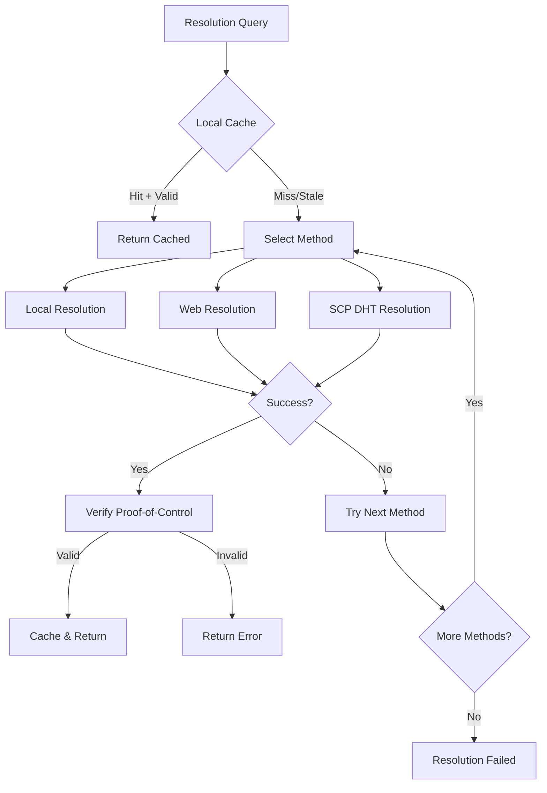
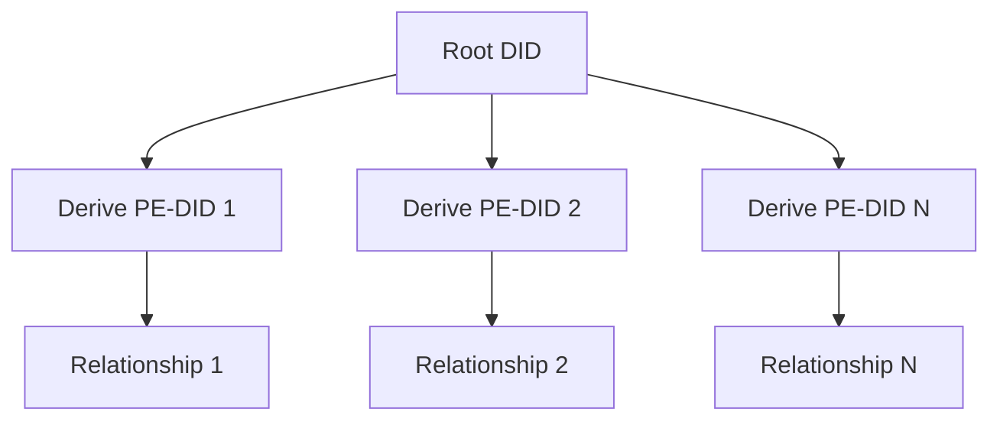

# Universal DID-Native Addressing (UDNA): Technical Specification

**Document Version:** 1.1  
**Standards Track:** Informational  
**Category:** Network Protocol  
**Author:** Amir Hameed Mir (Sirraya Labs)  
**Contributors:** AI-Assisted Technical Expansion  
**Date:** August 28, 2025  
**Status:** Draft Specification  

---

## Abstract

Universal DID-Native Addressing (UDNA) represents a paradigm shift in network architecture, elevating Decentralized Identifiers (DIDs) from application-layer constructs to fundamental network primitives. By making identity synonymous with address, UDNA eliminates the traditional separation between "who" and "where," providing inherent trust, authentication, and privacy at the network layer. This specification defines the complete technical framework for implementing UDNA-based systems, including protocol mechanics, cryptographic requirements, and architectural considerations.

## Status of This Document

This document is a draft technical specification. It is subject to change and should not be considered stable for production implementation without further review and standardization.

---

## Table of Contents

1. [Introduction](#1-introduction)
2. [Terminology](#2-terminology)  
3. [Architecture Overview](#3-architecture-overview)
4. [Core Protocol Specification](#4-core-protocol-specification)
5. [Resolution Subsystem](#5-resolution-subsystem)
6. [Cryptographic Framework](#6-cryptographic-framework)
7. [Network Layer: SCP Overlay](#7-network-layer-scp-overlay)
8. [Security and Privacy](#8-security-and-privacy)
9. [Implementation Guidelines](#9-implementation-guidelines)
10. [Interoperability](#10-interoperability)
11. [Formal Analysis](#11-formal-analysis)
12. [Future Considerations](#12-future-considerations)
13. [References](#13-references)
14. [Appendices](#14-appendices)

---

## 1. Introduction

### 1.1 Problem Statement

The contemporary Internet architecture suffers from a fundamental design flaw: the conflation of identity and location within IP addressing. An IP address simultaneously answers "who are you?" and "where are you?", leading to cascading complexity in subsequent protocol layers. This architectural decision has necessitated decades of supplementary protocols and workarounds:

- **DNS** for human-readable naming
- **PKI/CA systems** for establishing trust
- **NAT** for address space management  
- **Complex application-layer protocols** for authentication and authorization

These additions introduce centralization points, security vulnerabilities, and operational complexity that compound across the stack.

### 1.2 Solution Approach

UDNA proposes a radical architectural simplification: **Identity is Address**. By promoting Decentralized Identifiers (DIDs) from application constructs to network primitives, UDNA inherently provides:

1. **Self-sovereign identity** at the network layer
2. **Cryptographic authentication** as a first-class network service
3. **Privacy-by-design** through pairwise identifiers
4. **Decentralized trust** without certificate authorities
5. **Location independence** through identity-based routing

### 1.3 Design Principles

The UDNA specification adheres to the following core principles:

- **Decentralization**: No single point of control or failure
- **Self-Sovereignty**: Users control their own identity and keys
- **Privacy**: Unlinkable pairwise identities and encrypted communications
- **Interoperability**: Compatibility with existing DID methods and protocols
- **Extensibility**: Modular design supporting future cryptographic advances
- **Performance**: Efficient routing and minimal computational overhead

---

## 2. Terminology

### 2.1 Core Definitions

**Decentralized Identifier (DID)**
: A URI conforming to [RFC 3986] composed of three parts: `did:<method-name>:<method-specific-identifier>`. Each DID resolves to a DID Document containing cryptographic material and service endpoints.

**DID Document**
: A structured document (JSON-LD or CBOR) containing cryptographic keys, verification methods, and service endpoints associated with a DID. Formally represented as a tuple `D_doc(d) = (K, V, S)` where:
- `K`: Set of cryptographic keys
- `V`: Set of verification methods  
- `S`: Set of service endpoints

**UDNA Address**
: A unique, routable endpoint within the SCP network, defined as `A = f(did, facet_id)`, where `did` is a Decentralized Identifier and `facet_id` specifies a logical service port.

**Facet**
: A logical service endpoint on a UDNA node, identified by an 8-bit unsigned integer. Common facets include:
- `0x00`: Control channel
- `0x01`: Messaging service
- `0x02`: Storage service
- `0x03`: HTTP gateway

**Pairwise-Persistent DID (PP-DID)**
: A long-term root identity used to generate unlimited Pairwise-Ephemeral DIDs for specific relationships, maximizing privacy while maintaining recoverability.

**Pairwise-Ephemeral DID (PE-DID)**
: A short-lived DID derived from a PP-DID for specific transactions or relationships, providing unlinkable privacy.

**Zero-Knowledge Capability (ZCAP)**
: A cryptographically signed delegation token that authorizes specific actions on resources using zero-knowledge proofs for privacy-preserving authorization.

**SCP Overlay Network**
: The Sirraya Communication Protocol overlay network implementing a modified Kademlia DHT where Node IDs are derived from DID public keys.

### 2.2 Mathematical Notation

- `||` : Concatenation operator
- `⊕` : XOR operation  
- `H(x)` : Cryptographic hash function applied to x
- `Sig(sk, m)` : Digital signature of message m using private key sk
- `Verify(pk, m, σ)` : Signature verification using public key pk

---

## 3. Architecture Overview

### 3.1 Layered Architecture

UDNA implements a five-plane architecture:

```
┌─────────────────────────────────────────┐
│         Application Plane               │ 
│    (DApps, Services, User Interfaces)   │
└─────────────────────────────────────────┘
┌─────────────────────────────────────────┐
│         Security & Privacy Plane        │
│  (ZCAPs, Pairwise DIDs, Encryption)     │
└─────────────────────────────────────────┘
┌─────────────────────────────────────────┐
│           Network Plane                 │
│     (SCP Overlay, Routing, Discovery)   │
└─────────────────────────────────────────┘
┌─────────────────────────────────────────┐
│        Cryptographic Plane              │
│   (Key Management, Signatures, KDFs)    │
└─────────────────────────────────────────┘
┌─────────────────────────────────────────┐
│         Resolution Plane                │
│    (DID Resolution, Document Caching)   │
└─────────────────────────────────────────┘
┌─────────────────────────────────────────┐
│           Binary Plane                  │
│      (Wire Protocol, Header Format)     │
└─────────────────────────────────────────┘
```

### 3.2 Protocol Stack Comparison

| Layer | Traditional Internet | UDNA/SCP Network | Benefit |
|-------|---------------------|------------------|---------|
| **Addressing** | IP (Location-based) | DID (Identity-based) | Location independence |
| **Naming** | DNS (Centralized) | DID Resolution (Decentralized) | Censorship resistance |
| **Trust** | PKI/CA (Hierarchical) | Self-sovereign cryptography | No single points of failure |
| **Authentication** | Application layer | Network primitive | Simplified development |
| **Privacy** | Add-on services | Built-in design | Stronger default guarantees |

---

## 4. Core Protocol Specification

### 4.1 UDNA Address Header Format

The UDNA Address Header is the fundamental data structure for all network communications:

```
 0                   1                   2                   3
 0 1 2 3 4 5 6 7 8 9 0 1 2 3 4 5 6 7 8 9 0 1 2 3 4 5 6 7 8 9 0 1
├─┼─┼─┼─┼─┼─┼─┼─┼─┼─┼─┼─┼─┼─┼─┼─┼─┼─┼─┼─┼─┼─┼─┼─┼─┼─┼─┼─┼─┼─┼─┼─┤
│    Version    │           Flags           │         DIDType       │
├─┼─┼─┼─┼─┼─┼─┼─┼─┼─┼─┼─┼─┼─┼─┼─┼─┼─┼─┼─┼─┼─┼─┼─┼─┼─┼─┼─┼─┼─┼─┼─┤
│    DIDLength  │         FacetID           │        Reserved       │
├─┼─┼─┼─┼─┼─┼─┼─┼─┼─┼─┼─┼─┼─┼─┼─┼─┼─┼─┼─┼─┼─┼─┼─┼─┼─┼─┼─┼─┼─┼─┼─┤
│                          DIDBytes                                │
│                         (Variable)                               │
├─┼─┼─┼─┼─┼─┼─┼─┼─┼─┼─┼─┼─┼─┼─┼─┼─┼─┼─┼─┼─┼─┼─┼─┼─┼─┼─┼─┼─┼─┼─┼─┤
│                         KeyHint                                  │
│                        (32 bytes)                                │
├─┼─┼─┼─┼─┼─┼─┼─┼─┼─┼─┼─┼─┼─┼─┼─┼─┼─┼─┼─┼─┼─┼─┼─┼─┼─┼─┼─┼─┼─┼─┼─┤
│                        RouteHint                                 │
│                       (CBOR-encoded)                             │
├─┼─┼─┼─┼─┼─┼─┼─┼─┼─┼─┼─┼─┼─┼─┼─┼─┼─┼─┼─┼─┼─┼─┼─┼─┼─┼─┼─┼─┼─┼─┼─┤
│                          Nonce                                   │
│                        (16 bytes)                                │
├─┼─┼─┼─┼─┼─┼─┼─┼─┼─┼─┼─┼─┼─┼─┼─┼─┼─┼─┼─┼─┼─┼─┼─┼─┼─┼─┼─┼─┼─┼─┼─┤
│                        Signature                                 │
│                       (64+ bytes)                                │
└─┴─┴─┴─┴─┴─┴─┴─┴─┴─┴─┴─┴─┴─┴─┴─┴─┴─┴─┴─┴─┴─┴─┴─┴─┴─┴─┴─┴─┴─┴─┴─┘
```

### 4.2 Field Specifications

#### 4.2.1 Version (8 bits)
Protocol version identifier. Current version is `0x01`.

#### 4.2.2 Flags (16 bits)
Control flags with specific bit assignments:

```
 0                   1
 0 1 2 3 4 5 6 7 8 9 0 1 2 3 4 5
├─┬─┬─┬─┬─┬─┬─┬─┬─┬─┬─┬─┬─┬─┬─┬─┤
│P│R│E│A│K│      Reserved       │
└─┴─┴─┴─┴─┴─────────────────────┘
```

- **P (Bit 0)**: Pairwise flag - indicates PE-DID derived from PP-DID
- **R (Bit 1)**: Rotation flag - message contains key rotation proof  
- **E (Bit 2)**: Ephemeral flag - single-use DID, no state persistence
- **A (Bit 3)**: Acknowledgment requested - requests transport-layer ACK
- **K (Bit 4)**: Key pre-rotation hint - signals upcoming key rotation

#### 4.2.3 DIDType (8 bits)
Identifies the DID method:
- `0x01`: did:key
- `0x02`: did:web  
- `0x03`: did:scp
- `0x04`: did:ion
- `0xFF`: Reserved for experimental methods

#### 4.2.4 DIDLength (8 bits)
Length of DIDBytes field in bytes (1-255).

#### 4.2.5 FacetID (8 bits)
Service identifier:
- `0x00`: Control channel
- `0x01`: Messaging
- `0x02`: Storage
- `0x03`: HTTP gateway
- `0x80-0xFF`: Application-defined

#### 4.2.6 DIDBytes (Variable)
Raw DID string encoded in UTF-8, without the "did:" prefix.

#### 4.2.7 KeyHint (32 bytes)
BLAKE2b-256 hash of the public key used for signature verification, enabling efficient key lookup.

#### 4.2.8 RouteHint (Variable, CBOR-encoded)
Routing optimization metadata:

```cbor
RouteHint = {
  ? 1: enclave_id,        ; bstr, TEE identifier
  ? 2: relay_chain,       ; [*UDNA_Address], Relay addresses  
  ? 3: dht_locator,       ; [*NodeID], Closest DHT nodes
  ? 4: geo_region,        ; tstr, Geographic region hint
  * int: bstr,            ; Extension points
}
```

#### 4.2.9 Nonce (16 bytes)
Cryptographically random value preventing replay attacks.

#### 4.2.10 Signature (Variable)
Cryptographic signature over all preceding fields using the algorithm specified by the DID's verification method.

### 4.3 Header Validation Algorithm

```pseudocode
function validateUDNAHeader(header):
    // 1. Version check
    if header.version != CURRENT_VERSION:
        return ERROR_UNSUPPORTED_VERSION
    
    // 2. DID format validation  
    did = "did:" + getDIDMethodName(header.didType) + ":" + 
          utf8Decode(header.didBytes)
    if not isValidDID(did):
        return ERROR_INVALID_DID
    
    // 3. Resolve DID to get verification methods
    didDocument = resolve(did)
    if didDocument == null:
        return ERROR_RESOLUTION_FAILED
    
    // 4. Find correct verification method using KeyHint
    verificationMethod = findVerificationMethod(didDocument, header.keyHint)
    if verificationMethod == null:
        return ERROR_KEY_NOT_FOUND
    
    // 5. Construct signing payload
    signingData = header.version || header.flags || header.didType ||
                  header.didLength || header.facetID || header.reserved ||
                  header.didBytes || header.keyHint || header.routeHint ||
                  header.nonce
    
    // 6. Verify signature
    if not verify(verificationMethod.publicKey, signingData, header.signature):
        return ERROR_INVALID_SIGNATURE
    
    return SUCCESS
```

---

## 5. Resolution Subsystem

### 5.1 Resolution Architecture

The resolution subsystem implements a three-tiered trust model with graceful degradation:



### 5.2 DID Resolution State Machine

The resolver maintains the following states for each DID:

- **UNKNOWN**: DID not previously encountered
- **RESOLVING**: Resolution in progress
- **VALID**: Valid DID document cached
- **STALE**: Cached document expired, background refresh needed
- **INVALID**: Resolution failed, temporary backoff
- **ROTATED**: Key rotation detected, document invalidated

### 5.3 Proof-of-Control Verification

For a resolved DID Document to be considered valid, it must satisfy proof-of-control:

1. **Initial Resolution**: For `did:scp` methods, the DHT record must be signed by a key present in the DID Document itself
2. **Document Updates**: Updated documents must be signed by a key authorized in the previous valid version
3. **Key Rotation**: Rotation proofs must be signed by the previous key and include the new document hash

### 5.4 Caching Strategy

The resolution subsystem implements a multi-level cache:

1. **L1 Cache**: In-memory LRU cache (hot documents, ~1000 entries)
2. **L2 Cache**: Persistent local storage (warm documents, ~10,000 entries)  
3. **L3 Cache**: Distributed cache via SCP DHT (cold documents, unlimited)

Cache invalidation follows a time-to-live (TTL) model with exponential backoff for failed resolutions.

---

## 6. Cryptographic Framework

### 6.1 Mandatory Algorithms

UDNA implementations MUST support the following cryptographic primitives:

#### 6.1.1 Digital Signatures
- **Ed25519** (RFC 8032): Primary signature algorithm
- **ES256K** (RFC 7515): Ethereum ecosystem compatibility
- **BLS12-381**: For signature aggregation scenarios

#### 6.1.2 Key Agreement  
- **X25519** (RFC 7748): Primary key exchange
- **ECDH P-256**: Legacy compatibility

#### 6.1.3 Symmetric Encryption
- **ChaCha20-Poly1305** (RFC 8439): AEAD cipher (preferred)
- **AES-256-GCM**: Hardware-accelerated alternative

#### 6.1.4 Hash Functions
- **BLAKE2b**: Primary hash function (64-bit optimized)
- **BLAKE3**: High-performance alternative
- **SHA-256**: Legacy compatibility

### 6.2 Zero-Knowledge Capabilities (ZCAPs)

ZCAPs enable privacy-preserving authorization using zero-knowledge proofs:

```json
{
  "@context": "https://w3id.org/security/v2",
  "id": "urn:zcap:z6MkhaXgBZDvotDkL5257faiztiGiC2QtKLGpbnnEGta2doK",
  "controller": "did:scp:z6MkhaXgBZDvotDkL5257faiztiGiC2QtKLGpbnnEGta2doK",
  "invoker": "did:scp:z6MkrJVnaZkeFzdQyQbwmWsco8tgNdGtFzxHHFW5qNF1H5vD",
  "parentCapability": "urn:zcap:root:https://example.com/",
  "allowedAction": ["read", "write"],
  "resourceConstraints": {
    "path": "/secure-documents/*",
    "timeWindow": {
      "start": "2025-01-01T00:00:00Z",
      "end": "2025-12-31T23:59:59Z"
    }
  },
  "proof": {
    "type": "Ed25519Signature2020",
    "created": "2025-08-28T10:00:00Z",
    "verificationMethod": "did:scp:controller#key-1",
    "proofPurpose": "capabilityDelegation",
    "proofValue": "z4JPK9i8vKwYwR7Z8hJ5yGxCQ=="
  }
}
```

### 6.3 Key Rotation Protocol

Key rotation follows a formal protocol ensuring continuous service availability:

#### 6.3.1 Pre-rotation Phase
1. Generate new key pair
2. Create new DID Document with both old and new keys
3. Set `KeyHint` flag in headers to signal upcoming rotation
4. Distribute new document to DHT with extended TTL

#### 6.3.2 Rotation Phase  
1. Create rotation proof signed by old key
2. Broadcast rotation proof to all cached nodes
3. Update all service endpoints to use new key
4. Begin signing new messages with new key

#### 6.3.3 Post-rotation Phase
1. Monitor for any remaining old-key usage
2. After grace period, remove old key from DID Document
3. Update DHT with final document version

### 6.4 Rotation Proof Format

```json
{
  "@context": "https://schema.sirraya.io/rotation-proof/v1",
  "id": "urn:uuid:550e8400-e29b-41d4-a716-446655440000",
  "type": ["RotationProof"],
  "previousVerificationMethod": "did:scp:abc123#key-1",
  "newVerificationMethod": "did:scp:abc123#key-2", 
  "newDocumentDigest": "zQmWjz9v13SLX3B8T7y7k6vZ8mJ9wQ1",
  "validFrom": "2025-08-28T10:00:00Z",
  "validUntil": "2025-08-28T10:05:00Z",
  "reason": "routine",
  "proof": {
    "type": "Ed25519Signature2020",
    "verificationMethod": "did:scp:abc123#key-1",
    "proofPurpose": "capabilityDelegation", 
    "created": "2025-08-28T10:00:00Z",
    "proofValue": "z4bJ5K7cH8pQ3vN9mL2sW1xR6yT8"
  }
}
```

---

## 7. Network Layer: SCP Overlay

### 7.1 DHT Architecture

The SCP Overlay implements a modified Kademlia DHT with UDNA-specific optimizations:

#### 7.1.1 Node Identification
```
NodeID = BLAKE3(primary_verification_key_bytes)
```

This cryptographically binds node identity to DHT location, preventing Sybil attacks on routing.

#### 7.1.2 Distance Metric
```
distance(A, B) = NodeID_A ⊕ NodeID_B
```

Standard XOR distance metric enables efficient logarithmic routing.

#### 7.1.3 Stored Values
DHT stores signed `PeerInfo` structures rather than raw DID Documents:

```cbor
PeerInfo = {
  1: did,                    ; tstr, The DID itself
  2: multiaddrs,             ; [*tstr], Direct reachable addresses
  3: facets,                 ; [*FacetInfo], Advertised services
  4: timestamp,              ; uint, Record creation time
  5: signature               ; bstr, Signature by DID's key
}

FacetInfo = {
  1: id,                     ; uint, facet identifier
  2: capability              ; ?bstr, Optional ZCAP requirement
}
```

### 7.2 Routing Protocol

#### 7.2.1 Lookup Algorithm
```pseudocode
function lookup(targetNodeID):
    closest = localRoutingTable.findClosest(targetNodeID, K)
    
    while not converged:
        parallel_queries = []
        for node in closest:
            query = sendFindNode(node, targetNodeID)
            parallel_queries.append(query)
        
        responses = awaitAll(parallel_queries, timeout=5s)
        newClosest = []
        
        for response in responses:
            if response.success:
                newClosest.extend(response.nodes)
        
        newClosest = deduplicate(newClosest)
        newClosest.sortByDistance(targetNodeID)
        newClosest = newClosest[:K]
        
        if newClosest == closest:
            converged = true
        else:
            closest = newClosest
    
    return closest
```

#### 7.2.2 NAT Traversal and Relay System

Nodes behind NATs can participate through a relay system:

1. **Relay Discovery**: Query DHT for nodes advertising relay services
2. **Relay Contract**: Negotiate service terms using ZCAPs
3. **Relay Registration**: Update PeerInfo with relay chain
4. **Traffic Forwarding**: Relays forward packets based on UDNA headers

### 7.3 Security Mechanisms

#### 7.3.1 Sybil Resistance
- Node IDs cryptographically bound to DID keys
- Proof-of-work requirements for node registration  
- Reputation-based relay selection

#### 7.3.2 Eclipse Attack Prevention
- Diverse routing table maintenance
- Random walk discovery process
- Cross-validation of routing information

---

## 8. Security and Privacy  

### 8.1 Security Model

UDNA's security model assumes:

1. **Cryptographic Primitives**: Standard assumptions (SUF-CMA for signatures, IND-CCA2 for encryption)
2. **Network Adversary**: Dolev-Yao model - adversary controls network but not endpoints
3. **Honest Majority**: >50% of DHT nodes are honest
4. **Key Security**: Private keys are securely stored and managed

### 8.2 Formal Security Properties

#### 8.2.1 Address Integrity
**Theorem**: A UDNA Address Header cannot be modified in transit without detection.

**Proof**: The header signature is computed as `Sig(SK_i, H(header_fields))` where `SK_i` is the DID's private key. Verification requires `Verify(PK_i, H(header_fields), signature)` where `PK_i` is from the resolved DID Document. The security reduces to the existential unforgeability of the signature scheme under chosen message attacks (SUF-CMA).

#### 8.2.2 Identity Binding  
**Theorem**: A successful UDNA session establishes proof of private key possession.

**Proof**: The Noise_XX handshake pattern requires both parties to perform Diffie-Hellman operations using their static private keys. A party not possessing the private key corresponding to their advertised DID cannot complete the handshake, as the shared secret derivation will fail.

### 8.3 Privacy Architecture

#### 8.3.1 Pairwise Identity System



**Derivation Function**:
```
PE-DID = KDF(Root_Private_Key, Context_String)
where Context_String = relationship_id || timestamp || nonce
```

#### 8.3.2 Metadata Protection

- **Onion Routing**: Multi-hop relay chains with layered encryption
- **Traffic Analysis Resistance**: Dummy traffic and cover pools
- **Timing Attack Mitigation**: Random delays in message processing

#### 8.3.3 Forward Secrecy

All sessions implement forward secrecy through:
- Ephemeral key exchange in handshakes
- Regular session key rotation
- Secure deletion of expired keys

### 8.4 Quantum Resistance

Current UDNA cryptography is not quantum-resistant. The protocol includes agility mechanisms:

- **Algorithm Identifiers**: DIDType and KeyHint fields support post-quantum algorithms
- **Hybrid Modes**: Concurrent use of classical and post-quantum cryptography
- **Migration Protocol**: Secure transition to quantum-resistant algorithms

Planned post-quantum additions:
- **CRYSTALS-Dilithium**: Post-quantum signatures
- **CRYSTALS-Kyber**: Post-quantum key encapsulation
- **SPHINCS+**: Stateless hash-based signatures

---

## 9. Implementation Guidelines

### 9.1 Reference Architecture

```
┌─────────────────────────────────────────┐
│            Application Layer             │
│   (Web3 DApps, Messaging, Storage)      │
└─────────────────┬───────────────────────┘
                  │
┌─────────────────▼───────────────────────┐
│              UDNA SDK                   │
│  ┌─────────┐ ┌─────────┐ ┌───────────┐  │
│  │Resolver │ │ Crypto  │ │Transport  │  │ 
│  │ Engine  │ │ Engine  │ │  Stack    │  │
│  └─────────┘ └─────────┘ └───────────┘  │
└─────────────────┬───────────────────────┘
                  │
┌─────────────────▼───────────────────────┐
│           SCP Core Engine               │
│  ┌─────────┐ ┌─────────┐ ┌───────────┐  │
│  │   DHT   │ │  Wire   │ │    NAT    │  │
│  │ Routing │ │Protocol │ │ Traversal │  │
│  └─────────┘ └─────────┘ └───────────┘  │
└─────────────────────────────────────────┘
```

### 9.2 Core Interfaces

#### 9.2.1 Crypto Engine Interface
```rust
pub trait CryptoBackend: Send + Sync {
    fn sign(&self, key_id: &KeyId, message: &[u8]) 
        -> Result<Vec<u8>, CryptoError>;
    
    fn verify(&self, pubkey: &[u8], message: &[u8], signature: &[u8]) 
        -> Result<bool, CryptoError>;
    
    fn derive_shared_secret(&self, privkey_id: &KeyId, peer_pubkey: &[u8]) 
        -> Result<Vec<u8>, CryptoError>;
    
    fn generate_keypair(&self, algorithm: Algorithm) 
        -> Result<KeyId, CryptoError>;
    
    // Zero-knowledge proof operations
    fn create_proof(&self, statement: &Statement, witness: &Witness) 
        -> Result<Proof, CryptoError>;
    
    fn verify_proof(&self, statement: &Statement, proof: &Proof) 
        -> Result<bool, CryptoError>;
}
```

#### 9.2.2 Resolver Interface
```rust
pub trait Resolver: Send + Sync {
    async fn resolve(&self, did: &str) -> Result<DIDDocument, ResolverError>;
    
    async fn resolve_with_metadata(&self, did: &str) 
        -> Result<(DIDDocument, ResolutionMetadata), ResolverError>;
    
    fn cache_document(&self, did: &str, document: &DIDDocument, ttl: Duration);
    
    fn invalidate_cache(&self, did: &str);
}
```

#### 9.2.3 Transport Interface  
```rust
pub trait Transport: Send + Sync {
    async fn send(&self, destination: &UDNAAddress, payload: &[u8]) 
        -> Result<(), TransportError>;
    
    async fn receive(&self) -> Result<(UDNAAddress, Vec<u8>), TransportError>;
    
    async fn establish_session(&self, remote: &UDNAAddress) 
        -> Result<SessionId, TransportError>;
    
    fn close_session(&self, session_id: SessionId);
}
```

### 9.3 Implementation Considerations

#### 9.3.1 Threading Model
- **Async-first**: All I/O operations should be asynchronous
- **Work Stealing**: Use work-stealing schedulers for CPU-intensive tasks
- **Lock-free**: Minimize synchronization overhead with lock-free data structures

#### 9.3.2 Memory Management
- **Zero-copy**: Minimize data copying in hot paths
- **Pool Allocation**: Reuse buffers and objects to reduce GC pressure
- **Secure Deletion**: Cryptographic material must be securely erased

#### 9.3.3 Error Handling
```rust
#[derive(Debug, Error)]
pub enum UDNAError {
    #[error("DID resolution failed: {0}")]
    ResolutionFailed(String),
    
    #[error("Cryptographic operation failed: {0}")]
    CryptoError(#[from] CryptoError),
    
    #[error("Network error: {0}")]
    NetworkError(#[from] NetworkError),
    
    #[error("Protocol violation: {0}")]
    ProtocolError(String),
}
```

### 9.4 Performance Benchmarks

Reference implementations should achieve:

| Metric | Target | Rationale |
|--------|---------|-----------|
| DID Resolution | <100ms | Acceptable for interactive applications |
| Header Validation | <1ms | Network layer efficiency |
| Session Establishment | <200ms | Comparable to TLS handshake |
| DHT Lookup | <500ms | 3-hop average in 1M node network |
| Memory Usage | <50MB | Suitable for mobile deployment |

---

## 10. Interoperability

### 10.1 Legacy Internet Integration

#### 10.1.1 UDNA Gateway Architecture

The UDNA Gateway provides bidirectional translation between UDNA and traditional Internet protocols:

```
┌─────────────────┐    ┌─────────────────┐    ┌─────────────────┐
│   Legacy Web    │◄──►│   UDNA Gateway  │◄──►│  UDNA Network   │
│   Application   │    │                 │    │     Nodes       │
│  (HTTP/HTTPS)   │    │  ┌───────────┐  │    │                 │
│                 │    │  │HTTP→UDNA  │  │    │                 │
│                 │    │  │UDNA→HTTP  │  │    │                 │
│                 │    │  │DNS Bridge │  │    │                 │
└─────────────────┘    │  └───────────┘  │    └─────────────────┘
                       └─────────────────┘
```

#### 10.1.2 DNS Integration

Legacy DNS domains can advertise UDNA endpoints:

```
_udna.example.com. 300 IN TXT "did:scp:z6MkhaXgBZDvotDkL5257faiztiGiC2QtKLGpbnnEGta2doK"
```

#### 10.1.3 HTTP Translation Protocol

**Inbound (HTTP → UDNA)**:
1. Extract Host header from HTTP request
2. Query DNS for `_udna.<domain>` TXT record
3. Resolve DID to obtain service endpoints  
4. Establish UDNA session to `http` facet
5. Translate HTTP request to UDNA message format
6. Forward response back to HTTP client

**Outbound (UDNA → HTTP)**:
1. Parse UDNA destination for legacy indicators
2. Establish TLS connection to target server
3. Translate UDNA message to HTTP request
4. Process HTTP response and return via UDNA

### 10.2 DID Method Compatibility

UDNA supports all W3C-compliant DID methods:

#### 10.2.1 Method-Specific Handling

```rust
pub enum DIDMethod {
    Key(did_key::KeyDID),
    Web(did_web::WebDID), 
    SCP(did_scp::SCPDID),
    ION(did_ion::IONDID),
    Unknown(String),
}

impl DIDMethod {
    pub async fn resolve(&self) -> Result<DIDDocument, ResolverError> {
        match self {
            DIDMethod::Key(did) => did.resolve_locally(),
            DIDMethod::Web(did) => did.resolve_via_https().await,
            DIDMethod::SCP(did) => did.resolve_via_dht().await,
            DIDMethod::ION(did) => did.resolve_via_bitcoin().await,
            DIDMethod::Unknown(_) => Err(ResolverError::UnsupportedMethod),
        }
    }
}
```

#### 10.2.2 Cross-Method Messaging

UDNA enables seamless messaging between different DID methods:

```
did:key:alice  ──UDNA──► did:web:bob.example.com
did:scp:carol  ──UDNA──► did:ion:dave
```

The protocol layer abstracts method differences, providing uniform addressing.

### 10.3 Blockchain Integration

#### 10.3.1 Ethereum Compatibility
- Support for `did:ethr` addresses
- Integration with ENS (Ethereum Name Service)
- Smart contract interaction via UDNA

#### 10.3.2 Bitcoin Compatibility  
- Support for `did:btcr` addresses
- Lightning Network integration
- Taproot-based identity schemes

---

## 11. Formal Analysis

### 11.1 Protocol Verification

#### 11.1.1 State Machine Models

The UDNA protocol can be modeled as a collection of communicating state machines:

**DID Resolution State Machine**:
```tla+
VARIABLES 
    cache,          \* Local DID document cache
    resolving,      \* Set of DIDs currently being resolved  
    network_state   \* Network connectivity status

Init == 
    /\ cache = [did \in DID |-> NULL]
    /\ resolving = {}
    /\ network_state = "connected"

Resolve(did) ==
    /\ did \notin resolving
    /\ resolving' = resolving \union {did}
    /\ \/ /\ cache[did] # NULL 
          /\ cache[did].ttl > Now()
          /\ RETURN cache[did].document
       \/ /\ QueryNetwork(did)
          /\ AWAIT NetworkResponse(did)

UpdateCache(did, document, ttl) ==
    /\ cache' = [cache EXCEPT ![did] = 
                  [document |-> document, ttl |-> ttl]]
    /\ resolving' = resolving \ {did}
```

#### 11.1.2 Security Properties

**Property 1: Authentication Integrity**
```tla+
AuthenticationIntegrity ==
    \A session \in Sessions :
        session.authenticated => 
            ControlsKey(session.peer_did, session.peer_key)
```

**Property 2: Message Ordering**  
```tla+
MessageOrdering ==
    \A s1, s2 \in SentMessages :
        /\ s1.session_id = s2.session_id
        /\ s1.sequence < s2.sequence
        => s1.timestamp <= s2.timestamp
```

#### 11.1.3 Liveness Properties

**Property 3: Resolution Liveness**
```tla+
ResolutionLiveness ==
    \A did \in ValidDIDs :
        <>[] (ResolveRequest(did) ~> ResolveResponse(did))
```

### 11.2 Cryptographic Analysis

#### 11.2.1 Security Reductions

**Theorem 1**: UDNA header integrity reduces to signature scheme security.

**Proof Sketch**: 
- Assume adversary A can forge valid UDNA headers
- Construct signature forger B that uses A as subroutine
- B simulates UDNA environment for A, forwarding signature queries
- When A produces forged header, B extracts forged signature
- Contradiction with signature scheme security

**Theorem 2**: Session establishment provides mutual authentication.

**Proof Sketch**:
- Based on Noise protocol security analysis
- Forward secrecy from ephemeral key exchange
- Identity binding from static key authentication
- Mutual authentication from bidirectional key confirmation

#### 11.2.2 Computational Complexity

| Operation | Complexity | Notes |
|-----------|------------|-------|
| Header Validation | O(1) | Single signature verification |
| DID Resolution | O(log n) | DHT lookup in n-node network |
| Route Discovery | O(log n) | Kademlia routing |
| Session Establishment | O(1) | Fixed number of DH operations |

### 11.3 Privacy Analysis

#### 11.3.1 Unlinkability

**Definition**: Two protocol sessions are unlinkable if an adversary cannot determine whether they involve the same participant with probability significantly better than random guessing.

**Theorem**: UDNA provides unlinkability when using pairwise ephemeral DIDs.

**Proof**: PE-DIDs are derived using cryptographically secure KDFs with unique contexts. Without knowledge of the root private key, distinguishing PE-DIDs from random values is computationally infeasible under standard cryptographic assumptions.

#### 11.3.2 Traffic Analysis Resistance

UDNA employs several techniques to resist traffic analysis:

1. **Constant Rate Padding**: Maintain constant transmission rates
2. **Cover Traffic**: Generate dummy messages to mask real communication
3. **Onion Routing**: Multi-hop routing with layered encryption
4. **Timing Randomization**: Add random delays to break timing correlations

---

## 12. Future Considerations

### 12.1 Research Directions

#### 12.1.1 Quantum-Resistant Cryptography
- **NIST PQC Standards**: Integration of standardized post-quantum algorithms
- **Hybrid Security**: Transitional security using classical + post-quantum cryptography  
- **Quantum Key Distribution**: Integration with quantum communication channels

#### 12.1.2 Advanced Privacy Technologies
- **Private Information Retrieval**: Resolve DIDs without revealing queries
- **Homomorphic Encryption**: Computation on encrypted DID documents
- **Secure Multi-party Computation**: Collaborative resolution without data sharing

#### 12.1.3 Scalability Enhancements
- **Sharding**: Partition DHT across multiple overlay networks
- **Hierarchical Addressing**: Multi-level DID namespaces
- **Content-Addressable Storage**: IPFS integration for large DID documents

### 12.2 Standardization Roadmap

#### 12.2.1 Standards Bodies
- **IETF**: Internet-Draft submission for core protocol
- **W3C**: DID Method specification for `did:scp`
- **ISO/IEC**: Security evaluation and certification

#### 12.2.2 Implementation Milestones

**Phase 1**: Core Protocol (Q4 2025)
- Reference implementation in Rust
- Basic DID resolution and messaging
- Integration with major DID methods

**Phase 2**: Network Infrastructure (Q2 2026)  
- DHT overlay network deployment
- Relay system and NAT traversal
- Gateway services for legacy integration

**Phase 3**: Production Deployment (Q4 2026)
- Mobile and desktop applications
- Enterprise integration tools
- Performance optimization and scaling

### 12.3 Ecosystem Development

#### 12.3.1 Developer Tools
- **UDNA SDK**: Multi-language libraries (Rust, Go, JavaScript, Python)
- **Testing Framework**: Network simulation and protocol testing
- **Documentation**: Comprehensive guides and tutorials

#### 12.3.2 Applications
- **Decentralized Messaging**: End-to-end encrypted communication
- **Identity Management**: Self-sovereign identity solutions
- **IoT Security**: Device authentication and communication
- **Web3 Infrastructure**: Decentralized application networking

---

## 13. References

### 13.1 Normative References

- **[RFC2119]** Bradner, S., "Key words for use in RFCs to Indicate Requirement Levels", BCP 14, RFC 2119, March 1997.

- **[RFC3986]** Berners-Lee, T., Fielding, R., and L. Masinter, "Uniform Resource Identifier (URI): Generic Syntax", STD 66, RFC 3986, January 2005.

- **[RFC7515]** Jones, M., Bradley, J., and N. Sakimura, "JSON Web Signature (JWS)", RFC 7515, May 2015.

- **[RFC7748]** Langley, A., Hamburg, M., and S. Turner, "Elliptic Curves for Security", RFC 7748, January 2016.

- **[RFC8032]** Josefsson, S. and I. Liusvaara, "Edwards-Curve Digital Signature Algorithm (EdDSA)", RFC 8032, January 2017.

- **[RFC8439]** Nir, Y. and A. Langley, "ChaCha20 and Poly1305 for IETF Protocols", RFC 8439, June 2018.

### 13.2 Informative References

- **[DID-CORE]** Reed, D., Sporny, M., Longley, D., Allen, C., Grant, R., Sabadello, M., "Decentralized Identifiers (DIDs) v1.0", W3C Recommendation, 19 July 2022.

- **[NOISE]** Perrin, T., "The Noise Protocol Framework", 2018.

- **[KADEMLIA]** Maymounkov, P. and D. Mazieres, "Kademlia: A Peer-to-peer Information System Based on the XOR Metric", IPTPS 2002.

- **[ZCAP-LD]** Longley, D. and M. Sporny, "Authorization Capabilities for Linked Data v0.3", Digital Bazaar, 2021.

### 13.3 Cryptographic References

- **[BLAKE2]** Aumasson, J-P., Neves, S., Wilcox-O'Hearn, Z., and C. Winnerlein, "BLAKE2: simpler, smaller, fast as MD5", ACNS 2013.

- **[BLAKE3]** O'Connor, J., Aumasson, J-P., Neves, S., and Z. Wilcox-O'Hearn, "BLAKE3: one function, fast everywhere", 2020.

- **[BLS]** Boneh, D., Lynn, B., and H. Shacham, "Short Signatures from the Weil Pairing", Journal of Cryptology, 2004.

---

## 14. Appendices

### 14.1 Appendix A: ABNF Grammar

#### 14.1.1 UDNA Address Format
```abnf
udna-address = "udna://" did-identifier ":" facet-id
did-identifier = "did:" method-name ":" method-specific-id
method-name = 1*method-char
method-char = %x61-7A / DIGIT  ; lowercase letters and digits
method-specific-id = *idchar
idchar = ALPHA / DIGIT / "." / "-" / "_"
facet-id = 1*3DIGIT  ; 0-255
```

#### 14.1.2 ZCAP Grammar
```abnf
zcap-invocation = capability-id ":" signature
capability-id = "urn:zcap:" version ":" proof-components
version = "1"
proof-components = [ proof-purpose ";" ] [ invoker ";" ] [ nonce ]
proof-purpose = "p=" ( "capabilityInvocation" / "capabilityDelegation" )
invoker = "i=" did-identifier
nonce = "n=" 64HEXDIG
signature = [ algorithm ":" ] 1*base64char
algorithm = "ed25519" / "bls12381" / "es256k"
base64char = ALPHA / DIGIT / "+" / "/" / "="
```

### 14.2 Appendix B: Test Vectors

#### 14.2.1 DID Resolution Test Vector
```json
{
  "did": "did:scp:z6MkhaXgBZDvotDkL5257faiztiGiC2QtKLGpbnnEGta2doK",
  "expected_document": {
    "@context": "https://www.w3.org/ns/did/v1",
    "id": "did:scp:z6MkhaXgBZDvotDkL5257faiztiGiC2QtKLGpbnnEGta2doK",
    "verificationMethod": [{
      "id": "did:scp:z6MkhaXgBZDvotDkL5257faiztiGiC2QtKLGpbnnEGta2doK#key-1",
      "type": "Ed25519VerificationKey2020",
      "controller": "did:scp:z6MkhaXgBZDvotDkL5257faiztiGiC2QtKLGpbnnEGta2doK",
      "publicKeyMultibase": "z6MkhaXgBZDvotDkL5257faiztiGiC2QtKLGpbnnEGta2doK"
    }],
    "service": [{
      "id": "did:scp:z6MkhaXgBZDvotDkL5257faiztiGiC2QtKLGpbnnEGta2doK#messaging",
      "type": "MessagingService", 
      "serviceEndpoint": "udna://did:scp:z6MkhaXgBZDvotDkL5257faiztiGiC2QtKLGpbnnEGta2doK:1"
    }]
  }
}
```

#### 14.2.2 Header Signature Test Vector
```json
{
  "header_fields": {
    "version": 1,
    "flags": 0,
    "did_type": 3,
    "did_length": 46,
    "facet_id": 1,
    "did_bytes": "z6MkhaXgBZDvotDkL5257faiztiGiC2QtKLGpbnnEGta2doK",
    "key_hint": "a1b2c3d4e5f6789a1b2c3d4e5f6789a1b2c3d4e5f6789a1b2c3d4e5f6789a",
    "nonce": "0123456789abcdef0123456789abcdef"
  },
  "signing_input": "010003012E01z6MkhaXgBZDvotDkL5257faiztiGiC2QtKLGpbnnEGta2doKa1b2c3d4e5f6789a1b2c3d4e5f6789a1b2c3d4e5f6789a1b2c3d4e5f6789a0123456789abcdef0123456789abcdef",
  "expected_signature": "5a8b9c2d3e4f567890abcdef1234567890abcdef1234567890abcdef12345678901234567890abcdef1234567890abcdef1234567890abcdef1234567890abcdef"
}
```

### 14.3 Appendix C: Implementation Checklist

#### 14.3.1 Core Protocol Compliance
- [ ] UDNA header parsing and validation
- [ ] Ed25519 signature support
- [ ] X25519 key agreement  
- [ ] ChaCha20-Poly1305 encryption
- [ ] BLAKE2b/BLAKE3 hashing
- [ ] DID resolution with caching
- [ ] Key rotation protocol
- [ ] ZCAP creation and verification

#### 14.3.2 Network Protocol Compliance  
- [ ] DHT node implementation
- [ ] Kademlia routing algorithm
- [ ] NAT traversal support
- [ ] Relay system integration
- [ ] Peer discovery mechanism
- [ ] Network message framing
- [ ] Session establishment (Noise_XX)
- [ ] Forward secrecy implementation

#### 14.3.3 Security Requirements
- [ ] Secure key generation and storage
- [ ] Proof-of-control verification  
- [ ] Replay attack prevention
- [ ] Eclipse attack mitigation
- [ ] Sybil attack resistance
- [ ] Traffic analysis protection
- [ ] Secure memory management
- [ ] Constant-time operations

#### 14.3.4 Interoperability Requirements
- [ ] Multiple DID method support
- [ ] Legacy DNS integration  
- [ ] HTTP/HTTPS gateway
- [ ] Blockchain DID compatibility
- [ ] Cross-platform support
- [ ] Standards compliance testing
- [ ] Protocol version negotiation
- [ ] Graceful degradation
-
---

**Document Status**: This specification is a working draft and subject to change. Implementation feedback and security reviews are welcomed.

**Contact Information**: 
- Sirraya Labs: [contact@sirraya.org]
- Specification Issues: [https://github.com/w3c-cg/udna]
- Security Reports: [security@sirraya.org]

**Acknowledgments**: This work builds upon decades of research in distributed systems, cryptography, and decentralized identity. Special thanks to the W3C DID Working Group, IETF community, and the broader decentralized web ecosystem.